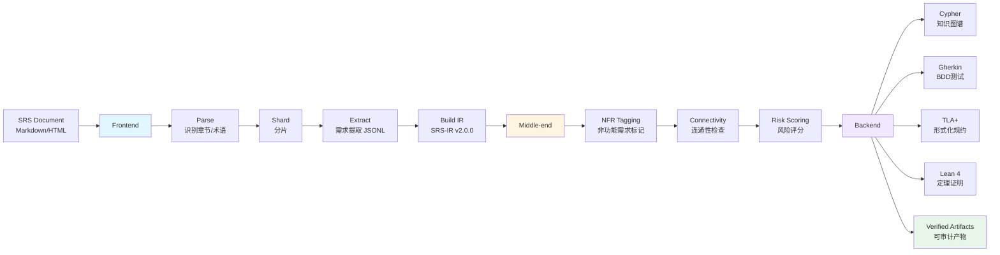
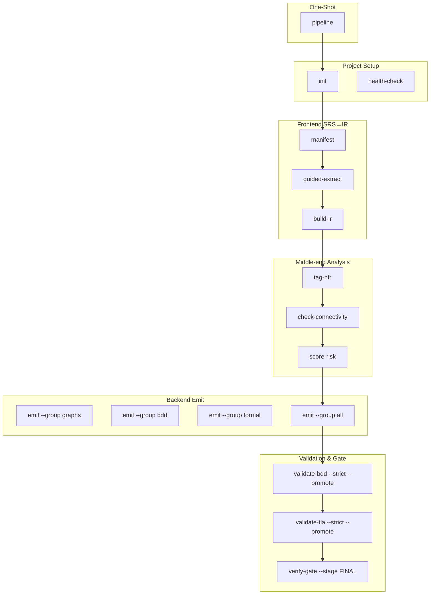

# SRS-Formalizer

将 SRS（软件需求规格说明）文档形式化为工程产物的 AI Agent 技能，采用**编译器架构**。

**English**: An AI Agent skill that formalizes Software Requirements Specification (SRS) documents into engineering artifacts using a compiler architecture.

[](LICENSE)
[](.claude/skills/srs-formalizer/scripts/tsconfig.json)
[]()

## 编译器架构 / Compiler Architecture

SRS-Formalizer follows a classic three-stage compiler pipeline:



```
SRS → Frontend (Parse→Shard→Extract→IR) → Middle-end (6 passes) → Backend (10 Emitters) → 输出产物
```

## 产出物 / Artifacts

| 产出 | Emitter | 触发 |
|------|------|:--:|
| 需求知识图谱 (Knowledge Graph) | CypherEmitter | 必选 |
| BDD 测试骨架 (BDD Scenarios) | GherkinEmitter | 必选 |
| TLA+ 形式化规约 (Formal Spec) | TLAEmitter | **全模块强制** |
| Lean 4 定理证明 (Theorem Proving) | LeanEmitter | 条件（安全/合规） |
| 测试夹具 (Test Fixtures) | FixtureEmitter | 可选 |
| 追溯矩阵 (Traceability Matrix) | TraceabilityEmitter | 必选 |
| 覆盖率报告 (Coverage Report) | CoverageEmitter | 可选 |
| 反例测试 (Counterexamples) | CounterexampleEmitter | 有条件 |

## 快速开始 / Quick Start

### 1. 环境要求 / Prerequisites

- Node.js ≥ 20
- Java JRE/JDK ≥ 11 (用于 TLA+ 验证)
- Lean 4 (可选，用于定理证明)

```bash
git clone https://github.com/WangHHY19931001/SRS-Formalizer.git
cd SRS-Formalizer/.claude/skills/srs-formalizer/scripts
npm install
```

### 2. 环境检查 / Health Check

```bash
# 验证环境并检查可用能力
npx tsx index.ts health-check
```

### 3. 一键流水线 / One-Shot Pipeline (Recommended)

使用提供的示例 SRS 体验完整流程：

```bash
# 第一步：初始化 + 解析SRS（到 guided-extract 停止，需要AI Agent）
npx tsx index.ts pipeline \
  --src ../examples/online-store-srs.md \
  --lang zh \
  --workdir .srs_formalizer

# 在 AI Agent 完成 guided-extract 后继续：
npx tsx index.ts pipeline --skip-init --workdir .srs_formalizer --strict
```

### 4. 分步执行 / Step-by-Step (For fine control)

```bash
# 前端: SRS → IR
npx tsx index.ts init --output .srs_formalizer
npx tsx index.ts manifest --src <srs-file> --lang zh --workdir .srs_formalizer
npx tsx index.ts guided-extract --workdir .srs_formalizer
npx tsx index.ts build-ir --workdir .srs_formalizer

# 中端: IR 分析
npx tsx index.ts tag-nfr --workdir .srs_formalizer
npx tsx index.ts score-risk --workdir .srs_formalizer

# 后端：发射草稿产物
npx tsx index.ts emit --group all --workdir .srs_formalizer

# 严格验证与提升
npx tsx index.ts validate-bdd --strict --promote --workdir .srs_formalizer
npx tsx index.ts validate-tla --name <module> --strict --promote --workdir .srs_formalizer
npx tsx index.ts verify-gate --stage FINAL --workdir .srs_formalizer
```

查看所有命令：

```bash
npx tsx index.ts --help
npx tsx index.ts --help pipeline    # 特定命令帮助
```

## CLI 命令分组 / Command Groups



| 组 | 命令 | 说明 |
|------|------|------|
| **Setup** | `init`, `health-check` | 初始化与环境检查 |
| **Frontend** | `manifest`, `guided-extract`, `build-ir` | SRS → IR |
| **Middle-end** | `tag-nfr`, `check-connectivity`, `score-risk` | IR 分析 |
| **Backend** | `emit --name/--group` | IR → draft/verified 产物 |
| **Validate** | `validate-bdd --strict --promote`, `validate-tla --strict --promote`, `verify-gate` | 验证与提升 |
| **One-Shot** | `pipeline` | 一键流水线（推荐新用户） |
| **Examples** | [`examples/`](.claude/skills/srs-formalizer/examples/) | 示例SRS与教程 |

## 产物生命周期 / Artifact Lifecycle

形式化产物不能从 draft 直接进入 FINAL。Emitter 只生成 draft 或确定性分析产物：

```
outputs/bdd/draft       → outputs/bdd/verified
outputs/tlaplus/draft  → outputs/tlaplus/verified
outputs/lean4/draft    → outputs/lean4/verified
outputs/graphs, fixtures, reports — 确定性产物，无需验证
```

使用各自的 `validate-… --strict --promote` 命令完成审计、工具链验证、报告写入与原子提升。

## 示例 / Examples

See [.claude/skills/srs-formalizer/examples/](.claude/skills/srs-formalizer/examples/) for:
- Complete example SRS: [online-store-srs.md](.claude/skills/srs-formalizer/examples/online-store-srs.md)
- Step-by-step walkthrough: [end-to-end-walkthrough.md](.claude/skills/srs-formalizer/examples/end-to-end-walkthrough.md)

## 验证 / Verification

```bash
# Run all checks before committing
cd .claude/skills/srs-formalizer/scripts
npm run typecheck    # TypeScript strict mode, 0 errors
npm test             # 487+ tests, 0 failures
npm run evals        # Deterministic toolchain evaluation
```

## 设计文档 / Documentation

完整的技能设计位于 **[docs/DESIGN.md](docs/DESIGN.md)**——唯一事实依据（Single Source of Truth）。

## 技术栈 / Tech Stack

- **TypeScript 5.5+** strict mode
- **Node.js ≥20** ESM
- **零运行时 npm 依赖** — devDeps only: typescript, @types/node, gherkin-lint, gherklin
- 测试：Node.js 原生 `node:test`（487+ 用例, 0 fail）
- IR：SRS-IR v2.0.0（强类型中间表示）
- 形式化工具：内置 TLA+ Tools + Lean 4 + gherkin-lint + Gherklin

## 安全设计 / Security

| 层级 | 机制 |
|:--:|------|
| 编译期 | Anti-Skill 注入防护（7 条规则） |
| 入口 | validateNoPoisonArgs + refuseDirectInvocation |
| 文件系统 | validateWorkDir + isPathSafe + assertSafePath |
| 流程 | 9 stage_gates + HITL (Human-in-the-loop) |

## 评估 / Evaluation

| 框架 | 结果 |
|------|:--:|
| SKILL-RUBRIC v0.1.5 | **B+** (8.1/10) |
| OWASP AST10 | **9/10** 通过 |
| SkillAudit | **Low Risk** |

## 许可 / License

MIT
