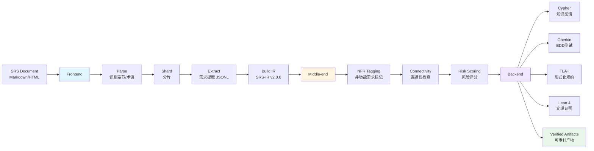

# SRS-Formalizer

将 SRS（软件需求规格说明）文档形式化为工程产物的 AI Agent 技能，采用**Agent 驱动架构**。

**English**: An AI Agent skill that formalizes Software Requirements Specification (SRS) documents into engineering artifacts using an agent-driven architecture.

[](LICENSE)
[](.claude/skills/srs-formalizer/scripts/tsconfig.json)
[]()

## Agent 驱动架构 / Agent-Driven Architecture

SRS-Formalizer follows a three-stage agent-driven pipeline (scripts only do gates + tools; semantic work is done by Agent via SKILL.md + prompts):



```
SRS → Frontend (Parse→Shard→Extract→IR) → Middle-end (6 passes) → Backend (Agent 生成 + 门禁提升) → 输出产物
```

## 产出物 / Artifacts

| 产出 | 生成方式 | 触发 |
|------|------|:--:|
| 需求知识图谱 (Knowledge Graph) | Agent + 模板 | 必选 |
| BDD 测试骨架 (BDD Scenarios) | Agent + 模板 | 必选 |
| TLA+ 形式化规约 (Formal Spec) | Agent + 模板 | **全模块强制** |
| Lean 4 定理证明 (Theorem Proving) | Agent + 模板 | 条件（安全/合规） |
| 测试夹具 (Test Fixtures) | Agent + 模板 | 可选 |
| 追溯矩阵 (Traceability Matrix) | Agent + 模板 | 必选 |
| 覆盖率报告 (Coverage Report) | Agent + 模板 | 可选 |
| 反例测试 (Counterexamples) | Agent + 模板 | 有条件 |

## 快速开始 / Quick Start

### 1. 环境要求 / Prerequisites

- Node.js ≥ 20
- Java JRE/JDK ≥ 11 (用于 TLA+ 验证)
- Lean 4 (可选，用于定理证明)
- 平台：Windows 与 Linux/WSL2 均已验证（跨平台路径与 hash 一致）

```bash
git clone https://github.com/WangHHY19931001/SRS-Formalizer.git
cd SRS-Formalizer/.claude/skills/srs-formalizer/scripts
npm install
```

### 2. 查看命令清单 / List Commands

```bash
npx tsx index.ts --help
```

### 3. 工作流说明 / Workflow

本技能为 Agent 驱动，无一键流水线命令。编排者经 SKILL.md 工作流逐步执行，每步通过门禁校验。

### 4. 分步执行示例 / Step-by-Step Example

```bash
# Frontend: Agent 解析 SRS → 分片 → 提取 JSONL → 装配 IR
npx tsx index.ts assemble-ir --workdir .srs_formalizer
npx tsx index.ts validate-jsonl --file <jsonl> --workdir .srs_formalizer

# Middle-end: Agent 分析 + check-connectivity 工具
npx tsx index.ts check-connectivity --workdir .srs_formalizer
npx tsx index.ts validate-semantics --workdir .srs_formalizer --strict

# Backend: Agent 生成 draft → 严格验证提升
npx tsx index.ts validate-bdd --strict --promote --workdir .srs_formalizer
npx tsx index.ts validate-tla --name <module> --strict --promote --workdir .srs_formalizer
npx tsx index.ts verify-gate --stage FINAL --workdir .srs_formalizer
```

查看所有命令：

```bash
npx tsx index.ts --help
npx tsx index.ts --help assemble-ir    # 特定命令帮助
```

## CLI 命令分组 / Command Groups

| 组 | 命令 | 说明 |
|------|------|------|
| **Gate Validators** | `validate-jsonl/semantics/architecture/cypher/bdd/tla/lean/glossary/checklist`, `verify-gate` | 确定性门禁校验 |
| **Independent Tools** | `assemble-ir`, `check-connectivity`, `query-graph`, `hash-compute`, `tlc-trace-parse`, `verify-skill-integrity`, `pack-skill` | 专用算法工具 |

## 产物生命周期 / Artifact Lifecycle

形式化产物不能从 draft 直接进入 FINAL。Agent 只生成 draft 或确定性分析产物：

```
outputs/bdd/draft       → outputs/bdd/verified
outputs/tlaplus/draft  → outputs/tlaplus/verified
outputs/lean4/draft    → outputs/lean4/verified
outputs/graphs, fixtures, reports — 确定性产物，无需验证
```

使用各自的 `validate-… --strict --promote` 命令完成审计、工具链验证、报告写入与原子提升。多模块 TLA+ 采用累加式提升（`promoteFilesMerge`，不清空其他模块），`verify-gate --stage FINAL` 按**模块集合**核验覆盖而非文件数。`hashFiles` 按 basename+内容寻址（与绝对路径无关），draft/verified 路径切换不影响报告匹配。

## 上游覆盖率门禁 / Upstream Coverage Gates

为防止"上游需求丢失但门禁全绿"的假通过：

- **S1 分片覆盖率硬核验**：`verify-gate --stage S1` 确认 `shard_index.json` 中每个分片都有非空 R1 提取（按 `R1-<shard>-NNNN` id 的分片段统计，区间命名文件无法掩盖缺口）；确无规范的分片须在 `2_extract/r1-explicit/_empty_shards.json` 显式声明。
- **架构溯源**：每条 arch-1 记录必须带 `source_shard`（`SNNN`）字段；可选顶层 `arch_version`（1|2|3）须与 id 前缀一致。
- 产物格式契约速查：`references/artifact-contract-cheatsheet.md`。

## 多轮需求提取精细化循环 / Multi-Round Refinement Loop

Frontend 采用**架构树版本化 × 需求提取交替演进**：显式 R1 → 架构树 v1 → 隐含 R2 → 架构树 v2（reparent/merge）→ 跨子系统补全 → 架构树 v3（依赖层）→ 精细化补全 → 装配 IR → 收敛闸门。`total_shards < 50` 退化为单版架构树；相邻版本 diff < 阈值提前收敛；迭代上限 5 轮，超限 `BLOCKED`。

**三态 provenance（守 Inversion 铁律）**：每条推导/补全需求写 `metadata.provenance`——`explicit-located`（逐字可定位 → 进 IR）、`doc-derived`（文档可推导，implicit + medium/low → 进 IR）、`needs-clarification`（推导不出 → **不进 IR**，挂 `GAPS.md`，走 HITL 单问题+推荐答案澄清）。`validate-jsonl` 硬校验三态，`needs-clarification` 禁入 r*/architecture JSONL。唯一事实源 = 设计文档；跨子系统补全只从文档推导。

**收敛双闸门（`verify-gate --stage R3`）**：连通性（孤儿逐个裁决，写 `_ctx/orphan_adjudications.json` 或补桥接边）+ 层次性（架构树 `contains` 链深度 ≥2，塌缩成平铺即 FAIL）。

## 示例 / Examples

See [.claude/skills/srs-formalizer/examples/](.claude/skills/srs-formalizer/examples/) for:
- Complete example SRS: [online-store-srs.md](.claude/skills/srs-formalizer/examples/online-store-srs.md)
- Step-by-step walkthrough: [end-to-end-walkthrough.md](.claude/skills/srs-formalizer/examples/end-to-end-walkthrough.md)

## 验证 / Verification

```bash
# Run all checks before committing
cd .claude/skills/srs-formalizer/scripts
npm run typecheck    # TypeScript strict mode, 0 errors
npm test             # 270 tests, 0 failures
npm run evals        # Deterministic toolchain evaluation
```

## 设计文档 / Documentation

完整的技能设计位于 **[docs/DESIGN.md](docs/DESIGN.md)**——唯一事实依据（Single Source of Truth）。

## 技术栈 / Tech Stack

- **TypeScript 5.5+** strict mode
- **Node.js ≥20** ESM
- **零运行时 npm 依赖** — devDeps only: typescript, @types/node, gherkin-lint, gherklin
- 测试：Node.js 原生 `node:test`（287 用例, 0 fail；Windows 与 Linux/WSL2 双平台验证）
- IR：SRS-IR v2.0.0（强类型中间表示）
- 形式化工具：内置 TLA+ Tools + Lean 4 + gherkin-lint + Gherklin

## 安全设计 / Security

| 层级 | 机制 |
|:--:|------|
| 编译期 | Anti-Skill 注入防护（7 条规则） |
| 入口 | validateNoPoisonArgs + refuseDirectInvocation |
| 文件系统 | validateWorkDir + isPathSafe + assertSafePath |
| 流程 | 17 commands (10 gates + 7 tools) + HITL (Human-in-the-loop) |

## 评估 / Evaluation

| 框架 | 结果 |
|------|:--:|
| SKILL-RUBRIC v0.1.5 | **B+** (8.1/10) |
| OWASP AST10 | **9/10** 通过 |
| SkillAudit | **Low Risk** |

## 许可 / License

MIT
