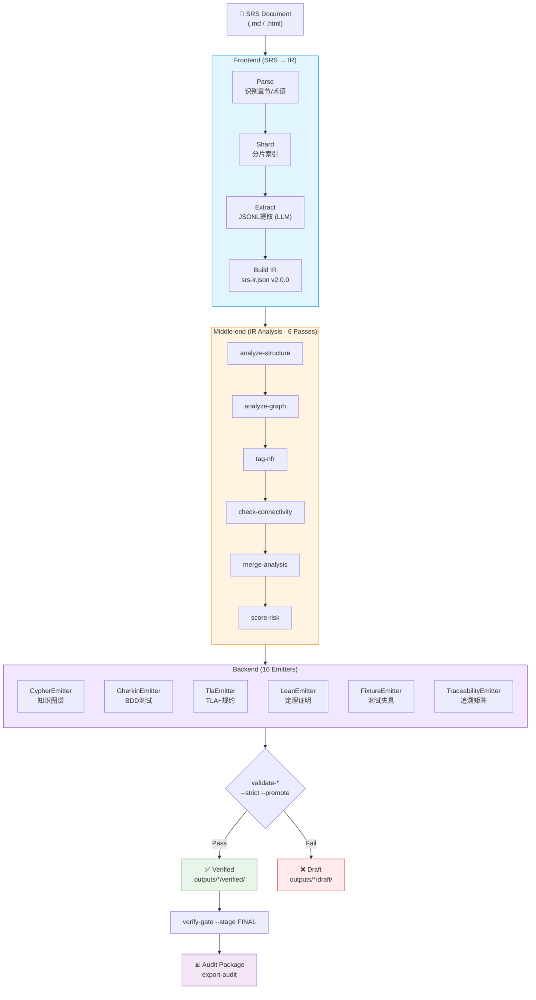
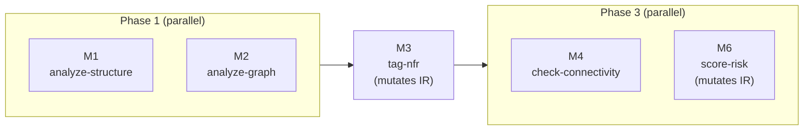
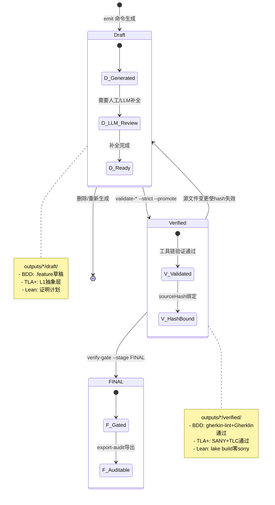
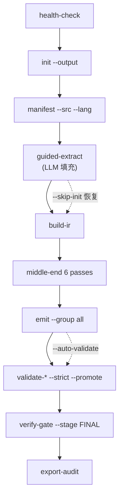

# SRS-Formalizer 设计文档

> **版本**: 1.0.1 | **日期**: 2026-07-13 | **状态**: Active
>
> 本文档是 srs-formalizer 技能开发的**唯一事实依据**（Single Source of Truth）。
> 所有设计决策、架构约束、规则合规、评估结果均记录于此。
> 代码变更必须首先更新本文档；本文档与代码不一致时，以本文档为准。

---

## 1. 概述

### 1.1 技能定义

| 属性 | 值 |
|------|-----|
| 名称 | `srs-formalizer` |
| 类型 | `framework`（基础框架型技能） |
| 主模式 | `compiler`（编译器三段式） |
| 领域 | `formal-methods` |
| 安全等级 | `high` |
| HITL | 强制 |
| 版本 | 1.0.1（语义化版本） |

### 1.2 核心能力

将 **SRS（软件需求规格说明）** 文档转化为形式化产出，采用编译器模型（Frontend → Middle-end → Backend）：

| 产出 | 格式 | 发射器 | 触发条件 |
|------|------|------|----------|
| 需求知识图谱 | Neo4j Cypher | CypherEmitter | 必选 |
| BDD 测试骨架 | Gherkin `.feature` | GherkinEmitter | 必选 |
| TLA+ 形式化规约 | `.tla` | TLAEmitter | **所有模块必选**；先生成草稿，完成 L1→L2→L3 与严格验证后交付 |
| Lean 4 定理证明 | `.lean` | LeanEmitter | security/compliance NFR 触发；先生成拆分计划，完成严格验证后交付 |
| 测试夹具 | pytest/JUnit/Cucumber/Playwright/fast-check | FixtureEmitter | 可选（选框架） |
| 追溯矩阵 | Markdown / Cypher | TraceabilityMatrixEmitter | 必选 |

### 1.3 何时不该使用

- 无 SRS 文档或需求规格说明时
- 纯代码审查/调试场景
- 非技术文档（营销文案、法律条款、合同）
- 用户仅需代码生成时

### 1.4 设计先行与规格一致性

`docs/DESIGN.md` 是行为、命令、文件契约和质量门禁的唯一规范。任何修改必须遵循以下顺序：

1. 先在本文档说明问题、目标行为、兼容性影响、失败语义和验证策略；
2. 再实现代码、提示词、模板和测试；
3. 最后以自动化一致性测试证明实现与本文档相符。

实现、`SKILL.md`、编排提示词、模板、CLI 帮助文本与本文档冲突时，均视为缺陷；不得通过修改实现绕过本文档的质量门禁。任何尚未通过严格验证的产物必须标记为 `draft`，不得进入 FINAL 门禁、交付清单或下游执行上下文。

设计变更必须同时更新：受影响的 CLI 契约、工作目录/产物路径、SRS-IR 数据契约、失败语义、门禁规则及测试矩阵。变更完成前不得宣称该能力已交付。

---

## 2. 架构设计

### 2.1 编译器三阶段架构

受 SkCC (arXiv:2605.03353) 启发，本技能采用经典编译器三段式架构：



**核心设计原则**:

| 原则 | 说明 |
|------|------|
| **单一 IR** | 所有产物从同一个 `srs-ir.json` 生成，保证一致性 |
| **前端/后端解耦** | 新增输出格式只需实现新 Emitter，不影响现有逻辑 |
| **IR 不可变** | 前端构建后 IR 只读，Emitter 为纯函数 |
| **O(m+n) 复杂度** | m 个输入源 + n 个 Backend Emitter |
| **可增量** | 局部 SRS 变更 → 局部 IR 重建 → 受影响 Emitter 重发射 |

### 2.2 与传统七阶段映射

| 编译器阶段 | 对应原阶段 | CLI |
|:----:|:--:|------|
| **Frontend** | S0-S3 | `manifest` → `guided-extract` → `build-ir` |
| **Middle-end** | S3 分析 | `analyze-structure` → `analyze-graph` → `tag-nfr` → `check-connectivity` → `merge-analysis` → `score-risk` |
| **Backend** | S4-S6 | `emit --group graphs\|bdd\|formal\|vmodel\|verify` |

### 2.3 设计模式

```
主模式: compiler
├── Inversion  @Frontend — 信息不全不进入 IR 构建，强制 interview
├── Generator  @Frontend — 零自由度填空模板，禁止增减字段
├── Reviewer   @Middle-end — 结构/语义/NFR 分析 passes
└── Emitter    @Backend  — 统一 Emitter 接口，纯函数 IR → 产物
```

### 2.4 渐进式披露（Progressive Disclosure）

| 级别 | 内容 | Token | 加载时机 |
|:----:|------|-------|----------|
| L1 | name + description | ~100 | 启动时加载 |
| L2 | SKILL.md 正文 | ≤5,000 | 技能激活时 |
| L3 | references/ + templates/ + prompts/ | 按需 | 指令明确要求时 |

### 2.5 提示词类型与角色

| 类型 | 数量 | 角色 | 约束 |
|------|:----:|------|------|
| **编排者** (Orchestrator) | 3 | 阶段级决策者：执行 CLI、分派子代理 | 技能完整性校验先于每阶段转换 |
| **执行者** (Executor) | 5 | 模板填充者：结构化输入 → 结构化 JSONL | 禁止增减字段、编造数据 |
| **执行者-领域** (Executor-Domain) | 3 | BDD/TLA+/Lean 4 领域专家 | 注入完整专家人设 |
| **验证者** (Verifier) | 4 | 独立审查者：新会话中逐项核验 | 强制新会话、禁止信任执行者报告 |
| **调试** (Debug) | 2 | 被动诊断：TLA+/Lean 构建失败时触发 | 不修改源代码，仅输出诊断报告 |

---

## 3. 设计决策

### 3.1 核心约束

| # | 决策 | 原因 |
|:--:|------|------|
| 1 | **零运行时 npm 依赖** | 技能自包含，不引入供应链风险 |
| 2 | **TypeScript strict** | `strict`, `noUnusedLocals`, `noUnusedParameters`, `exactOptionalPropertyTypes`, `noUncheckedIndexedAccess`, `noFallthroughCasesInSwitch` |
| 3 | **TS 只做确定性转换** | 不调用 LLM、不产生随机数、不依赖外部 API |
| 4 | **所有文件操作限定工作目录** | `.srs_formalizer/` 内，路径安全双校验 |
| 5 | **所有 CLI 经 index.ts** | `refuseDirectInvocation` 阻止绕过 |
| 6 | **统一错误处理** | `try/catch → { status, message }`，不抛异常 |
| 7 | **毒值拒绝** | `undefined/null/NaN/[object Object]` 入口拦截 |
| 8 | **文件大小** | ≤300 行（当前最大 283） |
| 9 | **禁止 `any`** | 所有错误类型用 `unknown` + `instanceof Error` |
| 10 | **`path.join()` 强制** | 禁止字符串拼接路径 |
| 11 | **`init` 用 `--output`，其余用 `--workdir`** | `validateWorkDir` 强制 `.srs_formalizer` 命名 |

### 3.2 为什么选编译器模型

受 SkCC 启发，srs-formalizer 本质上是 SRS → IR → 多目标产物的编译过程：

- **单一 IR**: `srs-ir.json` 承载所有语义信息
- **确定性**: IR 不可变，Emitter 为纯函数
- **可扩展**: 新增输出格式只需实现新 Emitter 并注册
- **可增量**: 局部 SRS 变更 → 局部 IR 重建 → 受影响 Emitter 重发射

### 3.3 为什么 NFR 条件触发 TLA+/Lean 4

| NFR 类别 | 触发条件 | 强制产物 |
|------|------|:--:|
| performance 关键词 ≥5 且 total_shards ≥100 | 高并发/分布式 | 强制 TLA+ |
| security/compliance 关键词 ≥1 | 安全关键 | 强制 Lean 4 |
| availability 关键词 ≥3 | 高可用 | 建议 TLA+ |

不适用时 Emitter 自动跳过。

---

## 4. SRS-IR Schema

SRS-IR 是编译器架构的单一事实来源。所有节点/边/元信息在此统一定义。

### 4.1 顶层结构

```typescript
interface SRSIR {
  version: '2.0.0';
  meta: IRMeta;
  nodes: IRNode[];
  edges: IREdge[];
  crossRefs: CrossRef[];
  nfrProfile: NFRProfile;
  gaps: IRGap[];
  glossary: IRGlossaryEntry[];
}
```

### 4.2 节点

```typescript
interface IRNode {
  id: string;
  type: IRNodeType;
  module: string;
  labels: string[];
  properties: IRProperties;
  source: IRSource;
  analysis?: IRAnalysis;
}

type IRNodeType =
  | 'requirement' | 'nfr' | 'architecture'
  | 'bdd_scenario' | 'tla_action' | 'tla_invariant'
  | 'lean_theorem' | 'lean_lemma';

interface IRProperties {
  statement?: string;
  category?: 'explicit' | 'implicit' | 'relational';
  confidence?: 'high' | 'medium' | 'low';
  nfrCategory?: NFRCategory;
  nfrThreshold?: NFRThreshold;
  archType?: 'Module' | 'Actor' | 'Constraint' | 'Component' | 'Interface';
}

type NFRCategory =
  | 'performance' | 'security' | 'availability'
  | 'compatibility' | 'maintainability' | 'compliance';

interface NFRThreshold {
  metric: string;  value: number;  unit: string;
  operator: '<' | '<=' | '>' | '>=' | '==';
}

interface IRSource {
  filePath: string;  startLine: number;  endLine: number;
  shardId: string;   chapter: string;
}

interface IRAnalysis {
  structure?: { orphan: boolean; islandId?: string; crossFileIsland: boolean; };
  semantic?: { duplicatePair?: string; conflictPair?: string; sameAspectCluster?: string; };
}
```

### 4.3 边

```typescript
interface IREdge {
  id: string;  source: string;  target: string;
  type: IREdgeType;
  properties: IREdgeProperties;
}

type IREdgeType =
  | 'depends_on' | 'refines' | 'conflicts_with' | 'derived_from'
  | 'same_aspect' | 'contains'
  | 'nfr_impacts' | 'nfr_constrains' | 'cross_file_depends'
  | 'verifies' | 'implements' | 'proves' | 'traces_to';

interface IREdgeProperties {
  crossFileWeight?: number;  confidence?: number;  reasoning?: string;
  /**
   * 标记此边为连通性检查器（check-connectivity）建议的桥接边，
   * 用于连接被检测为孤岛的需求节点。仅在分析阶段由 Middle-end 写入，
   * Emitter 在导出 Cypher 时据此添加 `proposed: true` 属性以便可视化区分。
   */
  proposed?: boolean;
}
```

### 4.4 辅助类型

```typescript
interface IRMeta {
  sourcePath: string;  sourceHash: string;  language: 'zh' | 'en';
  totalChars: number;  totalShards: number;
  totalNodes: number;  totalEdges: number;
  buildTimestamp: string;
  riskScore?: number;  highRiskShards?: string[];
}

interface CrossRef {
  sourceShard: string;  targetShard: string;
  refType: 'heading_ref' | 'term_ref' | 'explicit_see' | 'implicit_dep';
  anchorText: string;  confidence: number;
}

interface NFRProfile {
  detectedCategories: NFREntry[];
  weightedShards: NFRWeightedShard[];
  overallCoverage: number;
  blindSpots: NFRCategory[];
}

interface NFREntry {
  category: NFRCategory;  keywordHits: number;
  shardIds: string[];     nodeIds: string[];
}

interface NFRWeightedShard {
  shardId: string;  nfrWeight: number;  primaryCategory?: NFRCategory;
}

interface IRGap {
  priority: 'P0' | 'P1' | 'P2' | 'P3';
  type: 'unsolved_issue' | 'undefined_term' | 'missing_reference'
      | 'incomplete_section' | 'cross_chapter_gap';
  description: string;  sourceChapter: string;
}

interface IRGlossaryEntry {
  term: string;  acronym?: string;  definition: string;
  sourceShard: string;  confidence: 'high' | 'medium' | 'low';
  category: 'domain_concept' | 'acronym' | 'technical_entity'
          | 'business_entity' | 'defined_term';
}
```

### 4.5 IR 不可变性契约

- 前端 `build-ir` 生成 IR 后，文件只读写入，不再修改
- 中端 passes 读取 IR 并产生带 `analysis` 标注的副本
- 所有 Backend Emitter 以纯函数形式读取 IR
- IR 版本号 `2.0.0` 区别于旧版 `graph.json`

---

## 5. Frontend（前端）

**输入**: SRS 文档  
**输出**: `srs-ir.json`（不可变）  
**LLM 参与**: 仅 Pass 3（guided-extract）

### 5.1 Pass 1: Parser（确定性）

| 组件 | 功能 |
|------|------|
| `ChapterParser` | 章节层级树 + 12 个 NFR 关键词匹配（中英文） |
| `CrossRefDetector` | 四种跨章引用模式：标题引用、术语引用、显式"参见§X"、隐式依赖 |
| `NFRScanner` | 六类 NFR 关键词密度扫描，输出 `NFRProfile` |

### 5.2 Pass 2: Sharder（确定性）

递归分片：`MAX_SHARD_LINES = 200`。按章节标题分割，无标题时按段落回退。每个 shard 记录 `nfrWeight`（0-1）和邻接 shard 引用关系。

### 5.3 Pass 3: Extractor（LLM 参与）

| 提取类型 | 说明 |
|------|------|
| R1-explicit | 显式需求 |
| R2-implicit | 隐式需求 |
| R3-relational | `R3-` | 关系需求 |
| **R3-cross** (★) | `R3C-` | 跨分片关系二次扫描 |
| **R4-NFR** (★) | `R4N-` | NFR 专项提取 |
| Arch-1/2/3 | — | 架构分解（基础/增量/修正） |
| **Arch-4-NFR** (★) | — | NFR 架构节点 |

**动态架构轮次**: 根据 `totalShards` 输出：<50 → 3 轮，50-99 → 4 轮，≥100 → 5 轮。`crossRefCount > 50` → +1 轮。

### 5.4 Pass 4: IR Builder（确定性）

1. 读取所有 JSONL → 去重 → 构建 `IRNode[]` + `IREdge[]`
2. 合并 `crossRefs`、`nfrProfile`、`gaps`、`glossary`
3. 完整性验证（`validateIR`）：版本号 `2.0.0`、无悬挂边（`source`/`target` 必须在 `nodes[]` 中存在）、`buildTimestamp` 非空。不通过则 `build-ir` 返回 error。
4. 输出 `srs-ir.json`（存储在 workdir 根目录）

**IR 不可变性**：`build-ir` 生成 IR 后不再修改。中端 passes 和 Backend Emitter 只读。

### 5.5 CLI

| 命令 | 说明 |
|------|------|
| `manifest --src <path> --lang zh/en --workdir <path>` | Pass 1+2 |
| `guided-extract --type r1/r2/r3/r3-cross/r4-nfr/arch --workdir <path>` | Pass 3 |
| `inject-prompt --template <path> --params '{}'` | 模板注入 |
| `build-ir --workdir <path>` | Pass 4 |

---

## 6. Middle-end（中端）

全部确定性算法。无 LLM 依赖。输入和输出都是 `srs-ir.json`（annotated）。

| Pass | 组件 | 功能 |
|:--:|------|------|
| M1 | Structure Analyzer | 孤立节点 · 悬挂边 · 概念孤岛 · **跨文件孤岛** |
| M2 | Semantic Analyzer | Jaccard 重复检测 · 反义词冲突 · 同侧面聚类 |
| M3 | NFR Tagger (★) | NFR 节点自动分类 · 阈值正则提取（"≤200ms" → `{metric, value, unit, operator}`）· 盲点检测 |
| M4 | Connectivity Checker (★) | 跨 shard 连通性图 · 孤岛修复建议边 |
| M5 | Merge Optimizer | 子代理 verdict → 合并/冲突边/同侧面边 |
| M6 | Risk Scorer (★) | 风险因子：orphanRate(×0.2) + crossFileCoverage(×0.3) + nfrCoverage(×0.3) + gapWeight(×0.2) |

### 6.1 NFR 阈值提取（正则 + 启发式）

六类 NFR 各 5 个正则模式，含启发式回退。例如性能类：
```
/响应时间\s*[≤<=]\s*(\d+\.?\d*)\s*(ms|毫秒)/          → {metric:'response_time', ...}
/latency\s*[≤<=]\s*(\d+\.?\d*)\s*(ms|seconds?)/i     → {metric:'latency', ...}
/within\s+(\d+\.?\d*)\s*(ms|milliseconds?)/i          → 启发式回退
```

正则优先 → 未匹配则尝试启发式 → 仍未匹配则跳过（不报错，LLM 后续填充）。

### 6.2 NFR 分类与术语统一

全系统唯一的 NFR 分类为：`performance`、`security`、`availability`、`compatibility`、`maintainability`、`compliance`。SRS-IR 枚举、解析器关键词、BDD 模板、TLA+ 不变式、Lean 定理、fixture 分类、门禁与报告均只能使用这六项。

`reliability`、`observability` 等术语可作为 SRS 文本中的别名或映射信号，但不得成为独立的 IR 类别、Emitter 分支或验证门禁维度；需要新增类别时，必须先完成 DESIGN、IR schema、所有派生产物与迁移策略的设计变更。

| NFR 类别 | 中文关键词 | 英文关键词 |
|------|------|------|
| performance | 响应时间、延迟、吞吐、并发、性能 | latency, throughput, response time, concurrent |
| security | 安全、加密、认证、授权、防攻击 | encrypt, authentication, authorize, prevent |
| availability | 可用性、容错、冗余、恢复、高可用 | uptime, availability, fault, recovery, redundant |
| compatibility | 兼容、适配、浏览器、操作系统 | compatible, browser, platform, OS |
| maintainability | 可维护、扩展、模块化、可配置 | maintainable, extensible, modular, configurable |
| compliance | 合规、GDPR、PCI、审计、监管 | compliance, GDPR, PCI, audit, regulatory |

### 6.3 CLI

| 命令 | Pass | 说明 |
|------|:--:|------|
| `analyze-structure` | M1 | 结构分析 |
| `analyze-graph` | M2 | 语义分析 |
| `tag-nfr` (★) | M3 | NFR 标注 |
| `check-connectivity` (★) | M4 | 连通性检查 |
| `merge-analysis` | M5 | 合并子代理判决 |
| `score-risk` (★) | M6 | 风险评分 |

### 6.4 Pass 依赖与并行化

五个自动 Pass 的 I/O 与依赖关系如下。`pipeline.ts` 使用 `lib/pipeline/middle-end-runner.ts` 按三阶段并行执行：

| Pass | 读 IR | 写 IR | 写分析文件 | 依赖 |
|:----:|:----:|:----:|:----:|------|
| M1 analyze-structure | ✓ | — | ✓ | — |
| M2 analyze-graph | ✓ | — | ✓ | — |
| M3 tag-nfr | ✓ | ✓ (mutates) | — | — |
| M4 check-connectivity | ✓ | — | — | — |
| M6 score-risk | ✓ | ✓ (mutates) | — | M3（需 `nfrProfile.overallCoverage`） |

> M5 merge-analysis 为 LLM 子代理步骤，不在自动 pipeline 中执行。



**并行化策略**（`lib/pipeline/middle-end-runner.ts`）：

1. **Phase 1**（并行）：`analyze-structure` + `analyze-graph` — 均只读原始 IR，写不同分析文件，无冲突
2. **Phase 2**（串行）：`tag-nfr` — 修改 IR 添加 NFR 标签，必须独占执行
3. **Phase 3**（并行）：`check-connectivity` + `score-risk` — 均读取 NFR 标签后的 IR；`score-risk` 虽修改 IR 但仅写 `meta.riskScore` 与 `meta.highRiskShards`，不影响 `check-connectivity` 只读的 `nodes[]`/`edges[]`

**安全性**：`check-connectivity` 使用同步 `readFileSync` 读取完整 IR 到内存后操作其副本，`score-risk` 的 `writeFileSync` 不影响前者的内存副本。Node.js 单线程执行确保同步 I/O 操作不会真正并发。

**性能基准**：运行 `npm run benchmark` 生成不同节点规模下各阶段耗时报告（输出 `bench-results.json`）。

---

## 7. Backend（后端）

### 7.1 Emitter 接口

```typescript
interface Emitter {
  readonly name: string;
  readonly description: string;
  readonly outputDir: string;
  emit(ir: SRSIR, workdir: string, options?: Record<string, unknown>): EmitResult;
}

interface EmitResult {
  files: string[];  fileCount: number;
  metadata: Record<string, unknown>;
}
```

### 7.2 Emitter 清单（10 个）

Emitter 仅负责从 SRS-IR 生成确定性产物；对于需领域推理或工具验证才能完成的 BDD/TLA+/Lean 文件，Emitter 只能生成**草稿**，不能声称生成可交付的验证成品。

**图谱组 (4)**:

| Emitter | 输出 | 条件 |
|------|------|:--:|
| `CypherEmitter` | `srs-graph.cypher` | 必选 |
| `BehaviorGraphEmitter` | `behavior-graph.cypher` + `.json` | 有 BDD |
| `TlaGraphEmitter` | `tla-interaction.cypher` + `.json` | 有 TLA+ |
| `LeanGraphEmitter` | `lean-proof.cypher` + `.json` | 有 Lean 4 |

**BDD 组 (1)**:

| Emitter | 输出 | 说明 |
|------|------|------|
| `GherkinEmitter` | `outputs/bdd/draft/<module>.feature` | 必选草稿；只有补全 Given/When/Then、状态转换与验证方法，并通过 `validate-bdd --strict` 后，才可迁移至 `outputs/bdd/verified/` |

**形式化组 (2)**:

| Emitter | 输出 | 条件 |
|------|------|:--:|
| `TLAEmitter` | `outputs/tlaplus/draft/*.tla` | 所有模块生成层次化建模草稿；完成 L1→L2→L3、TypeOK、需求/NFR 不变式和 SANY/TLC 后迁移至 `outputs/tlaplus/verified/` |
| `LeanEmitter` | `outputs/lean4/draft/*.lean` | security/compliance 模块生成证明拆分计划；只有零 `sorry`/`admit`/`axiom`、零 warning 且 `lake build` 通过后迁移至 `outputs/lean4/verified/` |

**V-Model 组 (2)**:

| Emitter | 输出 | 条件 |
|------|------|:--:|
| `FixtureEmitter` | `test_*.py` / `*Test.java` / `*.spec.ts` | 选框架 |
| `CounterexampleEmitter` | `test_counterexample_*.py` | TLC trace |

**验证组 (1)**:

| Emitter | 输出 | 条件 |
|------|------|:--:|
| `TraceabilityMatrixEmitter` | `traceability.md` / `traceability.cypher` | 必选；产物可被 `verify-gate --stage FINAL` 直接消费 |

#### 7.2.1 产物生命周期状态机

形式化产物必须经过严格的 draft → verified → FINAL 状态转换，Emitter 只能生成 draft 状态产物：



### 7.3 CLI

`emit` 是唯一发射入口。其命令契约由 emitter 注册表提供，并由一致性测试校验；不得另设未注册的 `emit-all` 命令。

```
# 所有已注册的 Emitter（只生成 draft 或确定性非形式化产物）
emit --group all --workdir <path>

# 按组
emit --group graphs --workdir <path>
emit --group bdd --workdir <path>
emit --group formal --workdir <path>
emit --group vmodel --workdir <path>
emit --group verify --workdir <path>

# 单个
emit --name cypher --workdir <path>
emit --name gherkin --workdir <path>
emit --name fixture --workdir <path> --framework pytest --level nfr
```

`--group` 与 `--name` 互斥且必须二选一；未知名称、未注册组或重复参数必须返回 `{ status: "error" }` 并以非零退出。`all` 不等同于已验证交付：它只能包含确定性产物及 BDD/TLA+/Lean 草稿。

### 7.4 编译器复杂度

```
未引入 IR:  m 个输入 × n 个输出 = O(m×n)
引入 IR 后: m 个输入 → IR + n 个 Emitter = O(m+n)
```

---

## 8. CLI 命令清单

### 8.1 前端 (6)

| 命令 | 说明 |
|------|------|
| `init` | 初始化 `.srs_formalizer` 工作目录骨架（使用 `--output`，非 `--workdir`） |
| `manifest` | SRS 扫描分片 + 章节识别 + NFR 扫描 + 跨章引用 |
| `guided-extract` | 逐行提取 (R1/R2/R3/R3-cross/R4-NFR/Arch-1-4) |
| `inject-prompt` | 模板参数注入 |
| `build-ir` | 组装 SRS-IR |
| `build-architecture` | 从 `2_extract/architecture/` 构建架构子图并合并入知识图谱 |

### 8.2 中端 (7)

| 命令 | 说明 |
|------|------|
| `analyze-structure` | M1: 结构分析 |
| `merge-structure` | M1: 合并结构分析子代理判决（孤儿/悬挂边/孤岛） |
| `analyze-graph` | M2: 语义分析 |
| `merge-analysis` | M5: 合并子代理判决 |
| `tag-nfr` | M3: NFR 标注 |
| `check-connectivity` | M4: 连通性检查 |
| `score-risk` | M6: 风险评分 |

### 8.3 后端 (4)

| 命令 | 说明 |
|------|------|
| `emit` | `--group` / `--name` 分目标发射；`--group all` 发射全部已注册 Emitter |
| `generate-test-fixtures` | 独立 fixture 生成入口（`--level`/`--framework`，绕过 emit 注册表） |
| `generate-counterexample-fixtures` | 从 TLC 反例 trace 生成复现脚本（`--trace`/`--framework`） |
| `generate-vmodel-matrix` | 构建 V-Model 追溯矩阵（`--format markdown\|cypher`） |

### 8.4 验证与维护

| 命令 | 说明 |
|------|------|
| `validate-jsonl` | JSONL 格式校验 |
| `validate-semantics` | SRS-IR 语义一致性校验（类型/引用/属性/阈值，4 类检查，`--strict` 门禁模式） |
| `validate-architecture` | 架构 JSONL 校验 |
| `validate-glossary` | 术语表校验 |
| `validate-cypher` | Cypher 脚本校验 |
| `validate-bdd` | .feature 校验 (+NFR 规则) |
| `validate-tla` | SANY + TLC (+NFR 不变式) |
| `validate-lean` | lake build (+NFR 定理) |
| `validate-checklist` | CHECKLIST 校验 |
| `verify-gate` | 门禁 (S1/R3/FINAL + NFR) |
| `query-graph` | IR 查询（`--query node/neighbors/module/modules/path/context/brainstorm`） |
| `compile` | SKILL.md → SkIR |
| `pack-skill` | AES 加密备份 |
| `verify-skill-integrity` | 完整性校验 |
| `capability-probe` | 能力探测 (+NFR 触发) |
| `stability-test` | 跨 LLM 稳定性测试 |
| `fixture-coverage` | 覆盖报告 |

### 8.5 Agent 集成与流水线

| 命令 | 说明 |
|------|------|
| `pipeline` | 一键完整形式化流水线（含进度报告、会话持久化、自动验证） |
| `tools-schema` | 输出 OpenAI/Anthropic 兼容的 Tool/Function Calling Schema |
| `health-check` | 环境验证与能力自报告 |
| `status` | 工作目录状态面板（阶段、产物、下一步操作） |
| `export-audit` | 导出审计包（追溯矩阵、验证报告、hash 链） |

**一键流水线流程图:**



### 8.6 淘汰命令

以下命令从 `index.ts` 注册表移除（文件保留）：

| 淘汰 | 替代 |
|------|------|
| `build-graph` | `build-ir` |
| `export-cypher` | `emit --name cypher` |
| `generate-bdd` | `emit --name gherkin` |
| `build-behavior-graph` | `emit --name behaviorGraph` |
| `build-tla-graph` | `emit --name tlaGraph` |
| `build-lean-graph` | `emit --name leanGraph` |
| `build-system-architecture` | `build-architecture`（独立 CLI，非 emit） |

### 8.7 CLI 参数约定

| 参数 | 适用命令 | 说明 |
|------|----------|------|
| `--output` | init | 工作目录路径（仅 init） |
| `--workdir` | 大部分命令（init 除外） | 工作目录路径，必须为 `.srs_formalizer` |
| `--file <path>` | validate-* | 待校验文件路径 |
| `--group` / `--name` | emit | 发射器组或名称 |
| `--type` | guided-extract | r1/r2/r3/r3-cross/r4-nfr/arch |
| `--query <type>` | query-graph | node/neighbors/module/modules/path/context/brainstorm |
| `--stage S1\|R3\|FINAL` | verify-gate | 门禁阶段 |
| `--repair` | validate-checklist | 自动修复 |

### 8.8 CLI 输出格式

所有命令输出 JSON 到 stdout：`{ "status": "ok" | "error", "message"?: string, "data"?: ... }`。成功 exit(0)，失败 exit(1)。

### 8.9 refuseDirectInvocation 放置约定

所有命令文件末尾：
```typescript
import { refuseDirectInvocation } from '../lib/cli.js';
refuseDirectInvocation(import.meta.url);
```

---

## 9. 数据契约

### 9.1 JSONL 记录格式（前端产出）

```typescript
interface JsonlRecord {
  id: string;           // R[123]-[A-Za-z0-9_.]+-\d{4}
  category: 'explicit' | 'implicit' | 'relational';
  statement: string;
  source_file: string;
  confidence: 'high' | 'medium' | 'low';
  metadata?: Record<string, unknown>;
}
```

验证规则（`validate-jsonl`, 6 项）：id 正则、category/confidence 枚举、statement 非空、source_file 非空、metadata 关联 ID 合法。

### 9.2 ShardIndex（前端 Pass 2 中间产物）

```typescript
interface ShardIndex {
  version: '1.1';
  source_path: string;  source_hash: string;
  language: 'zh' | 'en';  total_chars: number;  total_shards: number;
  shards: ShardEntry[];  gaps: GapEntry[];  warnings: string[];
  cross_references: CrossRef[];   // ★ v1.1 新增
  nfr_profile: NFRProfile;        // ★ v1.1 新增
}

interface ShardEntry {
  id: string;  file: string;  locator: string;
  source_path: string;  source_start_line: number;  source_end_line: number;
  module: string;  chapter_ref: string;
  char_count: number;  estimated_tokens: number;
  nfr_weight?: number;  // ★ 新增
}
```

### 9.3 分片算法

- `MAX_SHARD_LINES = 200`（硬上限）
- 递归策略：按章节标题分割 → 章节回退 → 段落回退
- 超过阈值强制分割，无分割点时记录 warning
- Token 估算：中文 `chars / 1.5`，英文 `chars / 4`

### 9.4 阶段间文件契约

```
Frontend → _ctx/shard_index.json,
           2_extract/{r1-explicit,r2-implicit,r3-relational,architecture}/**/*.jsonl,
           srs-ir.json
Middle-end → 3_graph/{graph,analysis}/**/*.json,
             srs-ir.json (只读分析副本)
Backend draft → outputs/bdd/draft/*.feature,
                outputs/tlaplus/draft/*.tla + matching *.cfg,
                outputs/lean4/draft/{lakefile.lean|lakefile.toml, **/*.lean, lean-toolchain?}
Backend verified → outputs/bdd/verified/*.feature + validation/*.json,
                   outputs/tlaplus/verified/*.tla + matching *.cfg + validation/*.json,
                   outputs/lean4/verified/{lakefile.lean|lakefile.toml, **/*.lean, lean-toolchain?} + validation/*.json
Backend deterministic → outputs/graphs/*.cypher + *.json,
                        outputs/fixtures/**, outputs/reports/**
```

阶段号前缀 (`2_`, `3_`, `4_`, `5_`, `6_`) 由 `init` 命令创建，便于 `ls` 一眼看出每个阶段是否产出；Backend 仍使用 `outputs/` 子树承载 draft/verified/deterministic 生命周期（详见 `lib/artifacts/paths.ts` 的 `ARTIFACT_PATHS`）。

草稿目录与 verified 目录必须物理隔离。只有对应严格验证成功、验证报告包含输入 `sourceHash`、工具版本、执行时间和通过结论时，产物才可由 draft 迁入 verified。BDD 对已排序 `.feature` 集合计算 hash；TLA+ 对每个模块的 matching `.tla`/`.cfg` 配对计算 hash；Lean 对全部 `.lean`、Lake 项目定义及可选 `lean-toolchain` 计算 hash。FINAL 重新计算当前 verified 输入 hash，且只接受 `artifactKind`、`lifecycle: "verified"`、`passed: true` 和 `sourceHash` 均匹配的报告；过期、跨类型、畸形报告或草稿均不得消费。

---

## 10. SkIR 类型系统（技能编译用）

技能自身的 SKILL.md 编译也使用类似的编译器模型。SkIR 是技能编译的 IR。

### 10.1 核心枚举

```typescript
type SecurityLevel = 'low' | 'medium' | 'high' | 'critical';
type SkillMode = 'sequential' | 'alternative' | 'toolkit' | 'guideline';
type PermissionKind = 'network' | 'filesystem' | 'database' | 'execute' | 'mcp' | 'environment';
type ConstraintLevel = 'warning' | 'error' | 'critical';
```

### 10.2 SkillIR 关键字段

```typescript
interface SkillIR {
  name: string; version: string; description: string;
  security_level: SecurityLevel; hitl_required: boolean;
  pre_conditions: string[]; post_conditions: string[];
  fallbacks: string[]; permissions: Permission[];
  procedures: ProcedureStep[]; mode: SkillMode;
  anti_skill_constraints: Constraint[];
  // srs-formalizer 扩展
  pipeline_stages: PipelineStage[];
  capability_requirements: Record<string, Record<string, number>>;
  capability_tiers: CapabilityTier[];
  stage_gates: string[];
  source_path: string; source_hash: string; compiled_at: string;
}
```

---

## 11. 技能编译管线（SkCC 四阶段）

### 11.1 流水线

```
Phase 1 (Parser) → Phase 2 (IR Builder) → Phase 3 (Security Optimizer) → Phase 4 (Emitter)
```

| 阶段 | 输入 | 输出 | 失败行为 |
|------|------|------|----------|
| Phase 1 | SKILL.md | RawAST | Fail-Fast |
| Phase 2 | RawAST | SkillIR | Fail-Fast |
| Phase 3 | SkillIR | SkillIR(带约束) | Critical 阻断 |
| Phase 4 | SkillIR(带约束) | Claude XML / Generic MD | Fail-Fast |

### 11.2 Emitter 多平台发射

| 框架 | 发射器 | 输出格式 |
|------|------|------|
| Claude Code | `ClaudeXmlEmitter` | XML 语义分层 |
| Generic (7+ 平台) | `GenericMarkdownEmitter` | YAML + Markdown |

---

## 12. 门禁与验证

### 12.1 verify-gate 三级

| 阶段 | 主要检查项 |
|:----:|------|
| S1 | STATE.md, shard_index.json, JSONL 文件存在, 分片完整性, 术语表, Checklist |
| R3 | S1 检查 + 全部 JSONL 目录, ID 唯一性, 图谱可加载, 节点数 ≥ R1 数 |
| FINAL | R3 检查 + 当前 verified BDD/TLA+ 报告的 `sourceHash` 绑定；security/compliance NFR 时还要求当前 verified Lean Lake 项目及匹配报告 |

FINAL 只能读取 `outputs/**/verified/` 与确定性产物。若 IR 要求 BDD/TLA+/Lean，而对应 verified 产物不存在、验证报告不存在、报告种类/生命周期不符，或报告 `sourceHash` 与当前 verified 内容不匹配，则 FINAL 必须失败；不得以“未触发”、空目录、草稿文件、历史报告或弱化文本检查视为通过。

### 12.2 规格一致性测试

每次修改 CLI、Emitter、路径、模板、提示词或门禁时，必须执行自动化规格一致性测试。测试至少验证：

1. `index.ts` 注册表、CLI 帮助文本与 §8 命令清单完全一致；
2. emitter 注册表、分组定义与 §7.2/§7.3 完全一致；
3. `init` 创建的目录、Emitter 输出目录、验证器输入目录与 §9.4 完全一致；
4. SRS-IR 枚举和所有 NFR 消费方只使用 §6.2 的六类正式分类；
5. 硬门禁失败一律返回 `{ status: "error" }` 与非零退出；
6. 草稿产物无法被 FINAL、交付清单、跨图验证或执行上下文消费。

未具备上述测试的设计变更不得进入实现阶段。

### 12.3 跨图一致性验证（13 个根本问题）

原 10 个 + 3 个 NFR 问题：

| # | 问题 | 联合图谱 |
|:--:|------|------|
| Q1-Q10 | 原问题（是什么/做什么/能做什么/为什么/联合使用/内部行为/交互/外部/边界/兜底） | 需求+架构+行为+TLA++Lean |
| **Q11** (★) | 各模块的性能边界是否一致？ | 需求+NFR+TLA+ |
| **Q12** (★) | 安全约束是否在所有数据路径中一致应用？ | 需求+NFR+Lean |
| **Q13** (★) | 可用性降级路径是否覆盖所有关键模块？ | 需求+NFR+架构+行为 |

### 12.4 收敛循环（规模自适应）

```
total_shards ≤ 50   → max_iterations = 3, parallelism = 1
total_shards 51-100  → max_iterations = 5, parallelism = 2
total_shards > 100   → max_iterations = 8, parallelism = 4, 强制 NFR 分维度并行

收敛定义 = 全部 13 个 Q 可回答 + high-confidence ≥ 9/13
         + NFR 覆盖率 ≥ 80% + verify-gate FINAL pass
```

---

## 13. 安全设计

### 13.1 防御层次

| 层级 | 机制 |
|:----:|------|
| 编译期 | Anti-Skill Injector (7 规则, 94.8% 触发率) + Fail-Fast 10 条 |
| 入口 | `refuseDirectInvocation` + `validateNoPoisonArgs` + `safeParseArg` |
| 文件系统 | `validateWorkDir` + `isPathSafe` + `assertSafePath` |
| 流程 | 9 stage_gates + HITL + `verify-skill-integrity` |
| 备份 | SHA-256 + AES-256-GCM `.enc` |

### 13.2 Anti-Skill 注入规则

**SkCC 默认 (4)**：http-safety, loop-safety, db-destructive, parse-safety

**SRS 特化 (3)**：
- `srs-writeback`: 禁止无确认修改原始 SRS
- `verifier-isolation`: 验证者必须新会话
- `integrity-gate`: 阶段转换前运行 verify-skill-integrity

---

## 14. BDD 建模约束

### 14.1 格式要求

- 必须采用独立 `.feature` 文件格式，不接受 Markdown 描述
- 完整 Given → When → Then → And 步骤，Then 含 `# verification_method:`
- NFR 场景含具体阈值（"≤ 200ms"、"99.99%"）
- NFR Feature 文件独立：`NFRPerformance.feature`, `NFRSecurity.feature`, ...

### 14.2 质量门禁

| # | 检查 | 严重度 |
|:--:|------|:------:|
| 1-6 | 无占位符/error/failed/undefined/untested/步骤缺失/逻辑顺序 | 硬阻塞 |
| 7 | 不允许占位实现、简化实现、错误实现 | 硬阻塞 |
| 8 | **NFR 场景必须含具体数值阈值** (★) | 硬阻塞 |
| 9 | **安全场景必须含前置认证步骤** (★) | 硬阻塞 |
| 10 | 每个 SRS 需求至少一个可执行场景，且 Given/When/Then 映射初始状态、事件、预期状态 | 硬阻塞 |
| 11 | 运行 `validate-bdd --strict`；无 Feature 文件仅在 IR 明确声明无 BDD 范围时允许，否则失败 | 硬阻塞 |

验证失败时命令必须返回 `{ status: "error" }` 并以非零状态退出；不得以 `status: "ok"` 携带 `valid: false` 伪装为成功。验证通过后将 feature 与验证报告从 draft 迁入 verified。

---

## 15. TLA+ 建模约束

### 15.1 层次化拆解

L1(系统级) → L2(子系统级) → L3(原子级) → 可推广至 N 级。拆解判定：变量组合 >1k 考虑拆，>1w 强制拆。

### 15.2 NFR 不变式 (★)

每个模块必须覆盖正式 NFR 分类中的六类约束：`performance`、`security`、`availability`、`compatibility`、`maintainability`、`compliance`。有 SRS 阈值时使用该阈值；没有阈值时，草稿必须显式阻断为“阈值待决”，不得写入 `LLM_FILL` 后进入验证或交付目录。

```
PerfLatencyInv == latency ≤ MaxLatency     \* 性能上界
SecurityInv    == \A u ∈ Users : auth[u] => access_ok[u]  \* 安全
AvailInv       == Cardinality(dead_nodes) ≤ MaxDeadNodes  \* 可用性
```

### 15.3 可交付 TLA+ 的最低结构

每个 verified 模块必须：

- 使用单一、匹配文件名的模块头和 `====` 模块尾；
- 声明全部 `CONSTANTS` 与 `VARIABLES`，为常量提供 `ASSUME`；
- 定义 `TypeOK` 并覆盖所有状态变量；
- 定义非空 `Init`、带明确 guard 的 `Next`，以及引用已声明变量元组的 `Spec`；
- 将每个 SRS 状态转换与至少一个 Action 追溯关联；
- 生成层次关系 L1→L2→L3；状态组合超过 1k 时记录拆分评估，超过 1w 时必须继续拆分；
- 清理候选目录中的旧调试追踪仅能由操作者在验证前显式完成；验证器本身不创建或补写 `.cfg`、JAR、源模块或其他候选输入；
- `validate-tla --name <module> --strict --promote` 只读取 `outputs/tlaplus/draft/<module>.tla` 与 matching `<module>.cfg`，先运行静态占位符/结构审计，再使用内置 `tools/tla2tools-1.7.4.jar` 依次执行 SANY 和 TLC；
- SANY 语法/语义失败、TLC 不变量违规、死锁、超时或非零退出均必须失败；失败时不得创建成功报告或修改既有 verified 模块；
- 成功报告记录静态审计、SANY、TLC 的独立结果，以及 Java/JAR 版本、退出码、受限输出摘要与耗时；全部成功后才原子提升 `.tla`/`.cfg`。

### 15.4 质量门禁

| # | 检查 | 严重度 |
|:--:|------|:------:|
| 1 | 使用内置 `tools/tla2tools-1.7.4.jar` 的 SANY 语法、语义与层级检查 | 硬阻塞 |
| 2 | 使用同一 JAR 的 TLC 模型检查（启用死锁检测） | 硬阻塞 |
| 3-7 | 无死锁/状态爆炸/违法不变式/活锁/奇迹 | 硬阻塞 |
| 8 | 无 `LLM_FILL`、TODO/FIXME/TBD/GAP、待定、未定义、待实现或任何占位/简化/错误实现 | 硬阻塞 |
| 9 | TypeOK、需求不变式与六类 NFR 不变式均已在模型配置中检查 | 硬阻塞 |

TLC 使用的有限模型必须记录常量赋值、状态数、深度和对抽象边界的说明；状态爆炸不得通过降低模型语义或关闭关键不变式规避。

---

## 16. Lean 4 建模约束

### 16.1 Lake 项目契约与拆分证明

`outputs/lean4/draft` 与 `outputs/lean4/verified` 都是完整 Lake 项目根目录，必须含 `lakefile.lean` 或 `lakefile.toml`。可选 `lean-toolchain`、项目定义和所有参与构建的 `.lean` 文件均为验证输入并纳入 `sourceHash`；验证器不得写入或补全这些文件。

1. 在 draft 项目中编写可追溯的证明骨架（允许 `sorry`，且只能存在于草稿）；
2. 每个 `sorry` 拆为独立 lemma 文件与可验证子目标；
3. 若单一 theorem/lemma 不能完成，继续拆为多个 theorem/lemma 并通过最小化 `import` 组合；
4. `validate-lean --strict --promote` 在 Lake 项目根审计并运行 `lake build`；验证及报告成功后原子提升整个项目，直到 verified 中为 0 `sorry`、0 `admit`、0 `axiom`。

草稿不能被 FINAL、跨图收敛评分或下游执行代理作为已证明性质使用。

### 16.2 NFR 定理 (★)

Lean 4 建模从 security/compliance NFR 派生可追溯的 theorem 与 lemma 计划。草稿可用于拆分证明，但不得以 `True`、具体常量或其他弱化命题替代 SRS 性质；每个最终 theorem 必须表达原始安全/合规约束并关联 requirement ID。

```lean4
theorem response_time_bound : ∀ (op : Operation), time(op) ≤ max_latency := by
  -- 完整证明仅存在于 verified 目录
  exact proof_from_verified_lemmas
```

### 16.3 质量门禁

| # | 检查 | 严重度 |
|:--:|------|:------:|
| 1 | 0 `sorry` / `admit` / `axiom` | 硬阻塞 |
| 2 | `lake build` 通过且输出为 0 warning | 硬阻塞 |
| 3 | 每个声明为与 SRS 对应的 `theorem` + 完整 proof；禁止 `: True` 弱化 | 硬阻塞 |
| 4 | 每个 lemma 独立文件（≤100 行）；proof >50 行 或 have 块 >30 行必须拆分 | 硬阻塞 |
| 5 | 仅使用最小导入集合；禁止 `import Mathlib` 全量导入 | 硬阻塞 |
| 6 | 对每个交付 theorem 运行 `#print axioms`，拒绝未批准的公理依赖 | 硬阻塞 |
| 7 | 源码、编译输出与公理报告均写入验证报告，并通过 source hash 与 SRS-IR 关联 | 硬阻塞 |

`validate-lean --strict` 必须递归检查完整 Lake proof project（要求 `lakefile.lean` 或 `lakefile.toml`），而不是只检查传入的单个文件；在项目根调用 `lake build`，并将项目定义、可选 toolchain 和 Lean 输入 hash-bound 到成功报告。失败必须返回 `{ status: "error" }` 和非零退出，不得产生报告或修改 verified；只有审计、构建和报告均通过后才可原子提升完整项目。

### 16.4 平台限制

| 平台 | 支持 |
|------|:----:|
| Linux x86_64 | ✅ |
| macOS ARM64 | ✅ |
| Windows | ❌ 禁止 |

---

## 17. SRS 一致性升级流程

当形式化符合 SRS 设计但仍有问题时：

1. 不修改代码绕过问题
2. 写入 `SRS_PATCHES.md`：矛盾描述 + SRS 引用 + 可选项 A/B/C + 事实依据（允许联网搜索）
3. 等待人类确认
4. 若涉及安全关键需求，`security_level` 提升至 `critical`

---

## 18. 能力探测系统

### 18.1 8 维度 50 探针

| 维度 | 题数 |
|------|:--:|
| instruction_following | 8 |
| structured_output | 7 |
| precision | 6 |
| creative_reasoning | 5 |
| hierarchical_reasoning | 5 |
| logical_reasoning | 5 |
| formal_tlaplus | 7（工具链条件生成） |
| formal_lean4 | 7（工具链条件生成） |

### 18.2 Tier 判定

```
score = per-dimension pass rate (0-100)
tier  = min(all 8 dimension scores)
      ≥ 80 → high (full_auto)
      ≥ 50 → medium (guided)
      < 50 → low (human_in_loop)
```

### 18.3 工具链条件与 NFR 触发 (★)

TLA+/Lean 4 探针仅在有工具链时生成。NFR 检测增强：即使工具链未安装，若 IR 的 `nfrProfile` 标记了 performance/security 热点，输出"建议安装 TLA+/Lean 4"提示并标记维度为 `required_not_optional`。

---

## 19. 引导提取协议

### 19.1 两步模式

```
Step 1: --template → 生成 guided prompt
Step 2: --line '<json>' → 单行校验 → OK / ERR: <detail> / DONE
```

### 19.2 提取类型

```
r1/r2/r3/r3-cross/r4-nfr/arch
```

验证规则：id 正则 + category/confidence 枚举 + 字段完整性。

---

## 20. 技能完整性系统

### 20.1 备份不可变原则

`pack-skill --force`: 仅人类显式操作 → SHA-256 → MANIFEST.json → AES-256-GCM → `.enc`

### 20.2 校验流程

阶段转换前：`verify-skill-integrity` → SHA-256 对比 MANIFEST.json → 篡改检测 → `--repair` 恢复 → 暂停流水线 → 人类确认。

---

## 21. 稳定性测试

### 21.1 两阶段

```
Phase 1: stability-test --config llm-config.json --passes 3 → prompt manifests
Phase 2: stability-test --config llm-config.json --score <results-dir> → 评分报告
```

### 21.2 指标

```
Intra-model σ: < 1.0 = stable
Inter-model Δ: < 1.5 = consistent
Overall: max(0, 10 - avg(σ) - avg(Δ)) → 0-10 scale
```

---

## 22. 专家人设体系

三位形式化验证专家内置为 L3 参考资料。编排者在对应阶段加载。

### 22.1 BDD 行为建模专家

核心使命：将 SRS 业务规则转化为机器可执行、业务可读的 Gherkin 模型。信奉 Discovery → Formulation → Automation 三大支柱。严禁 Markdown 描述替代 `.feature` 文件。

### 22.2 TLA+ 并发系统建模专家

核心使命：通过 TLC 状态空间搜索提前发现死锁、活锁、不变式违例。严格执行层次化拆解 L1→L2→L3+，变量组合 >1w 强制拆。

### 22.3 Lean 4 定理证明专家

核心使命：通过构造性证明确保算法在数学上绝对成立。严格执行 Sorry 驱动开发四步循环，递归至 0 sorry。

---

## 23. 专家协作契约

### 23.1 仲裁优先级

| 优先级 | 专家 | 理由 |
|:--:|------|------|
| **最高** | Lean 4 | 数学绝对性 |
| **次高** | TLA+ | 状态空间穷尽探索 |
| **参考** | BDD | 业务语义正确性 |

### 23.2 需求细化联动

- BDD → TLA+：边界条件 → 状态不变量
- BDD → Lean 4：边界场景 → 证明前件
- TLA+ ↔ Lean 4：相互验证（状态异常 ↔ 隐含假设缺失）

---

## 24. Agent 自动安装设计

### 24.1 三层架构

- Layer 1: SKILL.md frontmatter（元数据）
- Layer 2: agent-card.json（A2A Protocol v1.0）
- Layer 3: references/auto-setup.md（可执行安装指南, 15 平台）

### 24.2 AI 安装协议

1. 平台检测 → 2. 目录复制 → 3. npm install + typecheck + test → 4. 可选激活配置 → 5. 验证

---

## 25. V-Model Test Fixture 生成

### 25.1 架构

TS 层做确定性骨架 + LLM 层做语义填充。一个入口 `emit --name fixture` dispatch 到 `lib/fixture-gen/`。

### 25.2 框架支持

| 框架 | 适用 level |
|------|------|
| Cucumber | acceptance |
| Playwright | acceptance, e2e |
| Pytest | unit, integration, nfr |
| JUnit | unit, integration, nfr |
| fast-check | property, nfr |

### 25.3 NFR 框架兼容矩阵 (★)

| NFR 类型 | cucumber | playwright | pytest | junit | fast-check |
|------|:--:|:--:|:--:|:--:|:--:|
| performance | — | — | ✅ | ✅ | ✅ |
| security | — | — | ✅ | ✅ | ✅ |
| availability | — | — | ✅ | ✅ | ✅ |
| compatibility | ✅ | ✅ | — | — | — |
| maintainability | — | — | ✅ | ✅ | — |
| compliance | — | — | ✅ | ✅ | — |

---

## 26. 评估结果

### 26.1 SKILL-RUBRIC v0.1.5

| 维度 | 得分 | 关键证据 |
|------|:----:|----------|
| D1 Problem-fit | 8/10 | 明确用户画像 + 反事实价值 |
| D2 Architecture | 9/10 | 编译器模型 + IR 不可变 + O(m+n) |
| D3 Reliability | 5/10 | 缺跨 LLM 数据（待 collection） |
| D4 Output-fit | 8/10 | 溯源 + 零往返 + 失败清晰 |
| D5 Lifecycle-fit | 7/10 | 版本管理 + IR 契约 + 生态集成 |

**加权平均**: 8.1/10 → **B+**（基于静态实现与自动化证据；跨 LLM 数据仍待收集）

### 26.2 OWASP AST10

通过率 **9/10**：SHA-256 防篡改 ✅, verify-skill-integrity ✅, 最小权限 ✅, Anti-Skill ✅, HITL ✅, A2A Agent Card ✅。

### 26.3 SkillAudit

安全风险等级: **Low**（0 高危发现）

---

## 27. 技术栈

| 组件 | 选型 | 版本 |
|------|------|------|
| 语言 | TypeScript (strict) | ≥5.5 |
| 运行时 | Node.js (ESM) | ≥20 |
| 执行器 | tsx | latest |
| 测试 | Node.js native `node:test` | built-in |
| 形式化 | tla2tools (内置) | 1.7.4 |
| 形式化 | Lean 4 + mathlib4 | latest |
| BDD 校验 | gherkin-lint | latest |
| IR 编译 | SRS-IR + SkIR | 2.0.0 |

```
运行时依赖: 0
开发依赖: typescript, @types/node
```

---

## 28. 测试策略

### 28.1 测试层级

| 层级 | 数量（目标） | 通过标准 |
|------|:----:|----------|
| 单元测试 | 487 | 0 failures |
| 集成测试 | `tests/assertions/` | 端到端正确 |
| Golden 测试 | `tests/golden/` | 输出与基准一致 |

### 28.2 运行命令

```bash
cd .claude/skills/srs-formalizer/scripts
npm install
npm run typecheck
npm test
npm run evals
```

`npm run evals` 是确定性回归套件：覆盖验证报告与当前 verified 内容的 hash 绑定、内置 TLA+ JAR 的 SANY/TLC 正反例，以及 artifact registry/文档契约。它写出 `eval-results.json`，记录每个套件的耗时、通过状态和可用的 Git commit。提交前必须使 typecheck、全量测试和 evals 全部通过。

---

## 29. 演化历史

| 版本 | 日期 | 关键变更 |
|------|------|----------|
| 1.0.1 | 2026-07-13 | **可验证产物生命周期加固**：Emitter registry 固化为 10 个；TLA+ 验证仅使用内置 `tla2tools-1.7.4.jar` 执行 SANY/TLC，不联网、不下载或补写 cfg；Lean 以完整 Lake 项目为验证和原子提升单位；FINAL 对 BDD/TLA+/Lean 重新计算 verified 内容 hash 并仅接受匹配 `sourceHash` 的成功报告；新增 `npm run evals` 确定性对抗评估。 |
| 1.0.0 | 2026-07-13 | **编译器架构重构**：S0-S6 流水线 → Frontend/Middle-end/Backend；SRS-IR 强类型 IR（§4）；10 个 Emitter 统一注册表（§7）；NFR 贯穿全阶段；跨文件引用 + 连通性 + 风险评分；7 条旧命令 + 旧 lib 模块 zip 归档至 `.worktrees/archive/`；CLI emit --group/--name 统一入口。详见 `docs/superpowers/specs/2026-07-13-compiler-refactor-design.md` |
| 0.8.0 | 2026-07-13 | V-Model Zero-Gap Wiring：bdd/tla/lean/playwright-page 迁移至 template-engine，generate-counterexample-fixtures，generate-vmodel-matrix，--level nfr，fixture-coverage 增强，测试 407→342 |
| 0.7.0 | 2026-07-13 | 模板引擎（16×6 框架），TLC 反例解析器，Hypothesis 模式识别，Playwright Page Object，追溯矩阵，NFR fixture，helpers 边界测试 |
| 0.6.0 | 2026-07-12 | V-Model 测试 fixture 生成（5 框架），fixture-coverage，Cypher 注入防护 |
| 0.5.7 | 2026-07-09 | 文件拆分 + 去重重构：16 个超限文件拆分，全部 ≤283 行 |
| 0.5.6 | 2026-07-09 | verify-gate 源重扫安全修复：Lean sorry/axiom + TLA+ 占位标记重扫 |
| 0.5.5 | 2026-07-07 | 专家人设体系 + 协作契约，三位领域专家内置为 L3 参考资料 |
| 0.5.3 | 2026-07-03 | 能力探测工具链条件生成 + 语法降级评分，路径 Bug 修复 |
| 0.5.0 | 2026-07-01 | 分片索引化重构，移除物理分片目录 |
| 0.4.0 | 2026-07-01 | SkCC 集成：compile, SkIR, Anti-Skill, 双发射器 |
| 0.1.0 | 2026-06-30 | S1 基础设施：init, manifest, 类型定义, 安全库, 25 测试 |

---

## 30. 参考

| 来源 | 链接 |
|------|------|
| SkCC 论文 | [arXiv:2605.03353](https://arxiv.org/abs/2605.03353) |
| SkillsBench | [arXiv:2602.12670](https://arxiv.org/abs/2602.12670) |
| SKILL-RUBRIC | [GitHub](https://github.com/acnlabs/OpenPersona/blob/main/docs/SKILL-RUBRIC.md) |
| OWASP AST10 | [owasp.org](https://owasp.org/www-project-agentic-skills-top-10/) |
| A2A Protocol v1.0 | [Linux Foundation](https://github.com/google/A2A) |
| 本项目仓库 | [GitHub](https://github.com/WangHHY19931001/SRS-Formalizer) |
| 编译器重构详细设计 | `docs/superpowers/specs/2026-07-13-compiler-refactor-design.md` |
