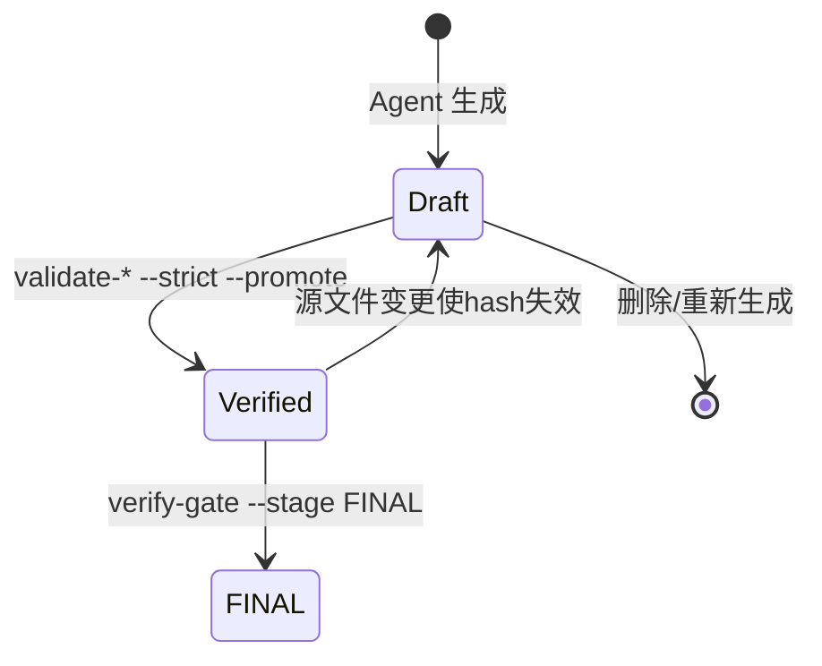

# SRS-Formalizer 设计文档

> **版本**: 2.0.0 | **日期**: 2026-07-16 | **状态**: Active
>
> 本文档是 srs-formalizer 技能开发的**唯一事实依据**（Single Source of Truth）。
> 所有设计决策、架构约束、规则合规、评估结果均记录于此。
> 代码变更必须首先更新本文档；本文档与代码不一致时，以本文档为准。
>
> 上一版本（v1.0.1，编译器三段式 + 脚本承担大量语义工作）归档于 `docs/DESIGN-v1.0.1.md`。

---

## 1. 概述

### 1.1 技能定义

| 属性 | 值 |
|------|-----|
| 名称 | `srs-formalizer` |
| 类型 | `framework`（基础框架型技能） |
| 主模式 | `pipeline`（Agent 驱动 + 脚本门禁） |
| 领域 | `formal-methods` |
| 安全等级 | `high` |
| HITL | 强制 |
| 版本 | 2.1.0（语义化版本） |

### 1.2 核心能力

将 **SRS（软件需求规格说明）** 文档转化为形式化产出：

| 产出 | 格式 | 触发条件 |
|------|------|----------|
| 需求知识图谱 | Neo4j Cypher | 必选 |
| BDD 测试骨架 | Gherkin `.feature` | 必选 |
| TLA+ 形式化规约 | `.tla` | 默认所有模块；用户明确裁剪时记录跳过范围与残余风险；先生成草稿，完成 L1→L2→L3 与严格验证后交付 |
| Lean 4 定理证明 | `.lean` | security/compliance NFR 触发；先生成拆分计划，完成严格验证后交付 |
| 测试夹具 | pytest/JUnit/Cucumber/Playwright/fast-check | 可选（选框架） |
| 追溯矩阵 | Markdown / Cypher | 必选 |

### 1.3 何时不该使用

- 无 SRS 文档或需求规格说明时
- 纯代码审查/调试场景
- 非技术文档（营销文案、法律条款、合同）
- 用户仅需代码生成时

### 1.4 执行范围与裁剪

默认执行完整 Frontend → Middle-end → Backend 依赖闭包。用户明确只要部分产物时，仅执行所需依赖阶段，并在 `STATE.md` 写入 `requested_outputs`、`skipped_steps`、`reason` 与 `residual_risk`。裁剪不得伪造未执行产物或 FINAL 通过。

### 1.5 设计先行与规格一致性

`docs/DESIGN.md` 是行为、命令、文件契约和质量门禁的唯一规范。任何修改必须遵循以下顺序：

1. 先在本文档说明问题、目标行为、兼容性影响、失败语义和验证策略；
2. 再实现代码、提示词、模板和测试；
3. 最后以自动化一致性测试证明实现与本文档相符。

实现、`SKILL.md`、编排提示词、模板、CLI 帮助文本与本文档冲突时，均视为缺陷；不得通过修改实现绕过本文档的质量门禁。任何尚未通过严格验证的产物必须标记为 `draft`，不得进入 FINAL 门禁、交付清单或下游执行上下文。

设计变更必须同时更新：受影响的 CLI 契约、工作目录/产物路径、SRS-IR 数据契约、失败语义、门禁规则及测试矩阵。变更完成前不得宣称该能力已交付。

---

## 2. 重构核心理念（v2.0.0 核心变更）

### 2.1 为什么要重构

v1.0.1 采用编译器三段式架构，脚本（commands/ + lib/）承担了大量本应由 LLM 完成的语义工作：章节解析、需求提取、NFR 分类、冲突检测、风险评估、产物生成（10 个 Emitter）、流程编排等。这导致：

- **职责错位**：脚本做语义判断（如 NFR 关键词匹配、Jaccard 重复检测）准确性不如 LLM，且无法处理 SRS 的语义多样性；
- **脚本膨胀**：39 个命令、~50 个 lib 模块、~50 个测试文件，维护成本高；
- **Agent 边界模糊**：脚本与 Agent 职责重叠，难以判断某件事该谁做；
- **能力浪费**：LLM 被脚本的确定性输出束缚，无法发挥语义理解优势。

### 2.2 新架构原则：脚本只做两件事

重构后脚本严格分为两类，**不再有"编译器阶段"概念**：

| 类别 | 职责 | 性质 | 可调用者 |
|------|------|------|----------|
| **门禁校验器 (Gate Validators)** | 对已存在产物做格式/规范/检查表类的**确定性校验**，只返回 pass/fail，绝不产生语义产物 | 纯检查、纯读 | Agent 在阶段转换时调用 |
| **独立工具 (Independent Tools)** | 处理 LLM 不便操作的**数据结构**或执行**专用算法**；Agent 主动调用以完成它无法可靠完成的事 | 纯计算/纯算法 | Agent 按需调用 |

### 2.3 脚本禁止做的事（全部交给 Agent）

- **语义判断**：解析章节、提取需求、NFR 分类、冲突检测、风险评估、子代理判决合并
- **产物生成**：Cypher/Gherkin/TLA+/Lean/fixture/traceability 的内容编写
- **流程编排**：pipeline 编排、status 报告、阶段决策、健康检查
- **模板填空**：inject-prompt 的字符串替换
- **技能元管理**：compile（SKILL.md 编译）、capability-probe、stability-test、tools-schema

### 2.4 Agent 承担的工作通过三层载体驱动

| 载体 | 职责 | 加载时机 |
|------|------|----------|
| `SKILL.md` | 工作流定义、阶段划分、调用门禁/工具的时机、Bootstrap 指令 | 技能激活时（L2） |
| `prompts/` | 编排者、执行者、验证者、调试者的阶段提示词 | 编排者按阶段注入子代理（L3） |
| `references/` | IR schema、生成指南、编码规范、专家人设 | 子代理按需加载（L3） |

### 2.5 渐进式披露（Progressive Disclosure）

| 级别 | 内容 | Token | 加载时机 |
|:----:|------|-------|----------|
| L1 | name + description | ~100 | 启动时加载 |
| L2 | SKILL.md 正文 | ≤5,000 | 技能激活时 |
| L3 | references/ + templates/ + prompts/ | 按需 | 指令明确要求时 |

### 2.6 提示词类型与角色

| 类型 | 角色 | 约束 |
|------|------|------|
| **编排者** (Orchestrator) | 阶段级决策者：调用门禁/工具、分派子代理、做流程决策 | 技能完整性校验先于每阶段转换 |
| **执行者** (Executor) | 语义填充者：解析/提取/分析/生成结构化产物 | 禁止编造数据、禁止跳过门禁 |
| **执行者-领域** (Executor-Domain) | BDD/TLA+/Lean 4 领域专家 | 注入完整专家人设 |
| **验证者** (Verifier) | 独立审查者：新会话中逐项核验 | 强制新会话、禁止信任执行者报告 |
| **调试** (Debug) | 被动诊断：TLA+/Lean 构建失败时触发 | 不修改源代码，仅输出诊断报告 |

---

## 3. 脚本清单（17 个，从 39 个缩减）

所有命令经 `npx tsx index.ts <command>` 调用，输出 JSON `{ status, message?, data? }`，成功 exit(0) / 失败 exit(1)。

### 3.1 门禁校验器（10 个）

| 命令 | 校验对象 | 检查项 | 关键参数 |
|------|----------|--------|----------|
| `validate-jsonl` | JSONL 记录 | 6 项：id 正则 `^R[123]-[A-Za-z0-9_.]+-\d{4}$`、category/confidence 枚举、statement 非空、source_file 非空、metadata 关联 ID 合法 | `--file <path> --workdir <path>` |
| `validate-semantics` | srs-ir.json | 4 类：类型一致性、引用完整性（无悬挂边）、属性合法性、阈值合法性；NFR 类别必须为六类正式分类；`--strict` 门禁模式 | `--workdir <path> [--strict]` |
| `validate-architecture` | 架构 JSONL | 6 项架构记录格式检查 | `--workdir <path>` |
| `validate-cypher` | .cypher | 4 项语法检查 | `--file <path> --workdir <path>` |
| `validate-bdd` | .feature | Phase1 TS 结构 + Phase2 NFR 专项 + Phase3 gherkin-lint + Phase4 Gherklin；`--strict --promote` 提升 | `--strict --promote --workdir <path>` |
| `validate-tla` | .tla + matching .cfg | 静态审计 + 内置 `tools/tla2tools-1.7.4.jar` SANY + TLC；`--strict --promote` 提升 | `--name <module> --strict --promote --workdir <path>` |
| `validate-lean` | Lake 项目 | `lake build` + sorry/axiom/warning 审计；`--strict --promote` 提升 | `--strict --promote --workdir <path>` |
| `validate-glossary` | 术语 JSON | 8 项 + 门禁 | `--file <path> --workdir <path>` |
| `validate-checklist` | CHECKLIST.md | 检查表完整性 | `--stage <S0-S6> --workdir <path> [--repair]` |
| `verify-gate` | 工作目录 | S1/R3/FINAL 三级门禁（详见 §7.10） | `--stage S1\|R3\|FINAL --workdir <path>` |

### 3.2 独立工具（7 个）

| 命令 | 类别 | 功能 | 关键参数 |
|------|------|------|----------|
| `assemble-ir` | 数据结构装配 | 读取所有 JSONL → 去重 → 装配 `srs-ir.json` + 引用完整性校验（悬挂边/重复 ID/版本号 `2.0.0`/buildTimestamp 非空）。不分析、不发射、不修改 JSONL | `--workdir <path>` |
| `check-connectivity` | 图算法 | 跨 shard 连通性、强连通分量（SCC）、孤岛检测、桥接边建议。LLM 在大图上无法可靠执行 | `--workdir <path>` |
| `query-graph` | 数据结构查询 | node/neighbors/module/modules/path 查询接口，避免 LLM 直读大 JSON | `--query <type> --params '<json>' --workdir <path>` |
| `hash-compute` | 确定性算法 | 计算/比对 sourceHash，绑定验证报告；FINAL 门禁与审计依赖 | `--file <path> [--compare <expected>] [--workdir <path>]` |
| `tlc-trace-parse` | 专用解析器 | 解析 TLC 反例 trace 为状态序列，供 Agent 生成反例 fixture | `--trace <path> [--workdir <path>]` |
| `verify-skill-integrity` | 安全关键 | SHA-256 比对 MANIFEST.json，`--repair` 从加密备份恢复 | `--skill-dir <path> [--repair]` |
| `pack-skill` | 安全关键 | **仅人类显式操作** → SHA-256 → MANIFEST.json → AES-256-GCM `.enc` | `--skill-dir <path> --force` |

### 3.3 移除清单（24 个命令 + 对应 lib 归档）

**Frontend 移除（5）**：`init`、`manifest`、`guided-extract`、`inject-prompt`、`build-architecture`
→ Agent 按 SKILL.md Bootstrap 段创建工作目录与模板；解析/分片/NFR 扫描/跨章引用/提取全部由 executor 提示词驱动；架构 JSONL 装配并入 `assemble-ir`

**Middle-end 移除（6）**：`analyze-structure`、`merge-structure`、`analyze-graph`、`merge-analysis`、`tag-nfr`、`score-risk`
→ 孤儿/悬挂边由 Agent 读 IR 判断；语义重复/冲突/聚类、NFR 分类与阈值提取、风险评分公式计算全部由 executor 提示词驱动；子代理判决合并由 Agent 直接做

**Backend 移除（5）**：`emit`、`generate-test-fixtures`、`generate-counterexample-fixtures`、`generate-vmodel-matrix`、`fixture-coverage`
→ 全部 10 个 Emitter 删除；Cypher/Gherkin/TLA+/Lean/fixture/traceability 内容由 Agent 经提示词 + 模板 + 专家人设生成；validate-* 门禁校验

**编排/元/工具移除（8）**：`pipeline`、`status`、`health-check`、`export-audit`、`tools-schema`、`compile`、`capability-probe`、`stability-test`
→ Agent 经 SKILL.md 编排；状态/健康检查由 Agent 读文件；审计包由 Agent 用 `hash-compute` 组装；compile/probe/stability/tools-schema 与 SRS 处理无关，归档

**对应 lib 归档**（约 50 个文件 → 24 个保留）至 `.worktrees/archive/2026-07-16/`：
- `frontend/`（除 builder 逻辑并入 assemble-ir）
- `emitters/`（全部 10 个 Emitter）
- `fixture-gen/`（全部）
- `architecture/`、`behavior-graph/`、`lean-graph/`、`tla-graph/`、`system-architecture/`、`traceability/`、`cross-graph/`
- `skir/`、`probe/`、`llm/stability/`
- `emitter-claude-xml.ts`、`emitter-generic-md.ts`、`prompt-templates.ts`
- `architecture/builder.ts` 中架构子图装配逻辑迁移至 `assemble-ir`

**保留的 lib**（24 个 .ts）：`verify-gate/{shared,checks-s1,checks-r3,checks-final}.ts`、`bdd-validator.ts`、`bdd-tool-runner.ts`、`tla-validator.ts`、`artifacts/{index,paths,promotion,validation-report}.ts`、`middle-end/connectivity-checker.ts`、`graph.ts`、`graph-algorithms.ts`、`graph-operations.ts`、`cypher.ts`、`security.ts`、`cli.ts`、`fs-utils.ts`、`jsonl.ts`、`id-utils.ts`、`skill-integrity.ts`、`text-analysis.ts`、`checklists.ts`（供 Agent 引用的纯工具函数）

---

## 4. Agent 工作流

Agent 经 SKILL.md 驱动整个流程。每个阶段：Agent 做语义工作 → 调用门禁校验 → 通过后进入下一阶段。

### 4.1 Bootstrap（替代 init）

Agent 按 SKILL.md Bootstrap 段指令创建工作目录结构（无脚本）：

```
.srs_formalizer/
├── srs-ir.json            # 核心中间表示 (v2.0.0)，assemble-ir 产出
├── _ctx/shard_index.json  # Frontend 产出（Agent 写）
├── 2_extract/             # Frontend: 需求提取 + 架构分解 JSONL
│   ├── r1-explicit/
│   ├── r2-implicit/
│   ├── r3-relational/
│   └── architecture/
├── 3_graph/               # Middle-end 分析输出（Agent 写）
│   ├── graph/
│   └── analysis/
├── outputs/               # Backend 产物生命周期
│   ├── graphs/            # Cypher 知识图谱（确定性产物，无 draft/verified 生命周期）
│   ├── bdd/{draft,verified,validation}/
│   ├── tlaplus/{draft,verified,validation}/
│   ├── lean4/{draft,verified,validation}/
│   ├── fixtures/
│   └── reports/
├── backups/               # 技能加密备份
└── STATE.md               # 阶段状态追踪（Agent 维护）
```

阶段号前缀（`2_`, `3_`）便于 `ls` 排查；Backend 使用 `outputs/` 子树承载 draft/verified 生命周期（详见 `lib/artifacts/paths.ts` 的 `ARTIFACT_PATHS`）。

### 4.2 Frontend 阶段（Agent 主导）

Frontend 采用**架构树版本化 + 需求提取交替演进**的多轮精细化循环：架构树（v1→v2→v3）与需求提取（显式 R1 → 隐含 R2 → 跨子系统补全）交替推进，每一轮的架构树为下一轮提取提供上下文，每一轮新增需求又驱动下一版架构树重构。最终以图谱**连通性 + 层次性双闸门**（步骤 G）判定收敛，未收敛则回退对应阶段精细化。

| 步骤 | Agent 工作 | 产出 | 门禁/工具 |
|------|-----------|------|-----------|
| F1 | 读 SRS → 识别章节层级、术语、跨章引用 → 分片（MAX_SHARD_LINES=200）→ NFR 关键词扫描 → 产出 `shard_index.json` | `_ctx/shard_index.json` | `validate-checklist --stage S1` |
| F2 | 按 shard 逐个提取显式需求 R1（可逐字定位，`explicit-located`） | `2_extract/r1-explicit/*.jsonl` | `validate-jsonl` + S1 覆盖率硬核验 |
| F3a | 构建**架构树 v1**（arch-1 基础树：module/actor/constraint，每条带 `source_shard`，`arch_version=1`） | `2_extract/architecture/arch-1*.jsonl` | `validate-architecture --workdir` |
| F4a | 结合[文档+R1+v1] 推导隐含需求 R2（三态裁决） | `2_extract/r2-implicit/*.jsonl` | `validate-jsonl` |
| F3b | 据[文档+R1+R2+v1] 重构**架构树 v2**（arch-2 reparent/merge，`arch_version=2`） | `2_extract/architecture/arch-2*.jsonl` | `validate-architecture --workdir` |
| F4b | 跨子系统需求补全（只从文档推导边界交互；三态裁决） | `2_extract/r3-relational/*.jsonl` | `validate-jsonl` |
| F3c | 据[文档+全需求+v2] 构建**架构树 v3**（arch-3 依赖层，`arch_version=3`） | `2_extract/architecture/arch-3*.jsonl` | `validate-architecture --workdir` |
| F4c | 精细化跨系统补全（三态裁决） | `2_extract/r3-relational/*.jsonl` | `validate-jsonl` |
| F4d | 术语提取 | glossary JSON | `validate-glossary --file` |
| F5 | 调用工具装配 IR → 层次交联需求图谱 | `srs-ir.json` + `graph.merged.json` | `assemble-ir --workdir` |
| G | **收敛闸门**：连通性（`connectedComponents==1`，孤儿逐个裁决）+ 层次性（架构树深度 ≥2，识别 ≥N 层子系统）；未收敛回退对应 F 阶段 | `_ctx/orphan_adjudications.json` | `verify-gate --stage R3` |

**三态 provenance（守 Inversion 铁律）**：每条推导/补全需求必须落入且仅落入一态——
- `explicit-located`：源文档可逐字定位 → `category: explicit` + `source_shard`+行号，正常进 IR；
- `doc-derived`：文档可推导但非逐字 → `category: implicit` + `confidence: medium/low` + `metadata.provenance='doc-derived'`，进 IR；
- `needs-clarification`：文档推导不出的决策点 → **不进 IR**，写 `GAPS.md`，走 HITL 单问题+推荐答案；人确认后降级为前两态回写。

推导不出的需求绝不以 `explicit/high` 混入 IR。跨子系统补全（F4b/F4c）只从设计文档推导边界交互，`frozen/` 不是输入。

**收敛控制与退化**：架构树 v1/v2/v3 与提取交替执行；相邻版本架构树 diff < 阈值即提前收敛；迭代上限 5 轮，超限标 `BLOCKED`。`total_shards < 50` 时退化为**单版架构树**（仅 F3a），不强制三版；此时 arch_version 允许仅取 1。

**HITL 单问题格式**（决策树拷问，方法论①）：每次只抛一个决策性问题 + Agent 推荐答案 + 可选项，人类"同意/修改/否决"后写回；`GAPS.md` 记录问题、推荐答案、裁决结果。术语碰撞（方法论②）只对设计文档做，发现矛盾（如"部分退款"vs"整单退款"）强制中断并抛出。

**分片算法**（Agent 遵循）：`MAX_SHARD_LINES = 200`；递归策略：按章节标题分割 → 章节回退 → 段落回退；Token 估算：中文 `chars/1.5`，英文 `chars/4`。

**shard ID 规则**：`S001`~`S999`（纯 ASCII）；每个分片含 `locator`（`{file_abspath}-{start}-{end}-{chunk_id}`）；R1 提取 ID 格式 `R1-<shard_id>-NNNN`。

### 4.3 Middle-end 阶段（Agent 主导 + 图算法工具）

| 步骤 | Agent 工作 | 产出 | 门禁/工具 |
|------|-----------|------|-----------|
| M1 | 读 IR → 判断孤儿节点、悬挂边、概念孤岛、跨文件孤岛 | `3_graph/analysis/structure.json` | `validate-semantics --strict` |
| M2 | 读 IR → Jaccard 重复检测、反义词冲突、同侧面聚类 | `3_graph/analysis/semantic.json` | — |
| M3 | 读 IR → NFR 节点分类、阈值正则提取、盲点检测 → 写回 IR 的 `nfrProfile` | `srs-ir.json`（mutate nfrProfile） | `validate-semantics --strict` |
| M4 | 调用图算法工具检查跨 shard 连通性 | `3_graph/analysis/connectivity.json` | `check-connectivity --workdir` |
| M5 | 子代理冲突判决 → Agent 直接合并/标记冲突边/同侧面边 | `srs-ir.json`（mutate edges） | — |
| M6 | 读 IR → 按风险公式计算风险评分 → 写回 `meta.riskScore` | `srs-ir.json`（mutate meta） | — |

**NFR 阈值提取**（Agent 执行，正则优先 → 启发式回退 → 跳过不报错）：六类 NFR 各 5 个正则模式，详见 `references/nfr-threshold-extraction-guide.md`。

**NFR 分类**（全系统唯一）：`performance`、`security`、`availability`、`compatibility`、`maintainability`、`compliance`。SRS-IR 枚举、BDD 模板、TLA+ 不变式、Lean 定理、门禁与报告均只能使用这六项。`reliability`、`observability` 等术语可作为别名或映射信号，但不得成为独立类别。

| NFR 类别 | 中文关键词 | 英文关键词 |
|------|------|------|
| performance | 响应时间、延迟、吞吐、并发、性能 | latency, throughput, response time, concurrent |
| security | 安全、加密、认证、授权、防攻击 | encrypt, authentication, authorize, prevent |
| availability | 可用性、容错、冗余、恢复、高可用 | uptime, availability, fault, recovery, redundant |
| compatibility | 兼容、适配、浏览器、操作系统 | compatible, browser, platform, OS |
| maintainability | 可维护、扩展、模块化、可配置 | maintainable, extensible, modular, configurable |
| compliance | 合规、GDPR、PCI、审计、监管 | compliance, GDPR, PCI, audit, regulatory |

**风险评分公式**（Agent 计算，`references/risk-scoring-formula.md` 详述）：
```
riskScore = orphanRate × 0.2 + crossFileCoverage × 0.3 + nfrCoverage × 0.3 + gapWeight × 0.2
```

**NFR 条件触发 TLA+/Lean 4**（Agent 判断）：

| NFR 类别 | 触发条件 | 强制产物 |
|------|------|:--:|
| performance 关键词 ≥5 且 total_shards ≥100 | 高并发/分布式 | 强制 TLA+ |
| security/compliance 关键词 ≥1 | 安全关键 | 强制 Lean 4 |
| availability 关键词 ≥3 | 高可用 | 建议 TLA+ |

不适用时 Agent 跳过对应产物生成。

### 4.4 Backend 阶段（Agent 生成 + 门禁提升）

| 步骤 | Agent 工作 | 产出 | 门禁/工具 |
|------|-----------|------|-----------|
| B1 | 读 IR → 生成 Cypher 知识图谱 | `outputs/graphs/srs-graph.cypher` | `validate-cypher --file` |
| B2 | 读 IR → 生成 BDD `.feature` 草稿 | `outputs/bdd/draft/*.feature` | `validate-bdd --strict --promote` |
| B3 | 读 IR → 生成 TLA+ 草稿 + matching `.cfg` | `outputs/tlaplus/draft/*.tla` + `*.cfg` | `validate-tla --name <m> --strict --promote` |
| B4 | 读 IR（security/compliance NFR）→ 生成 Lean 4 Lake 项目草稿 | `outputs/lean4/draft/{lakefile,**/*.lean}` | `validate-lean --strict --promote` |
| B5 | 读 IR + verified 形式化产物 → 生成测试夹具 | `outputs/fixtures/**` | — |
| B6 | 读 IR + 所有 verified 产物 → 生成追溯矩阵 | `outputs/reports/traceability.{md,cypher}` | — |
| B7 | 读 verified 产物 + 验证报告 → 计算 hash → 组装审计包 | 审计目录 | `hash-compute` + `verify-gate --stage FINAL` |

**产物生命周期状态机**（Agent 写 draft，validate-* `--promote` 提升，verify-gate FINAL 收口）：



草稿目录与 verified 目录必须物理隔离。只有对应严格验证成功、验证报告包含输入 `sourceHash`、工具版本、执行时间和通过结论时，产物才可由 draft 迁入 verified。BDD 对已排序 `.feature` 集合计算 hash；TLA+ 对每个模块的 matching `.tla`/`.cfg` 配对计算 hash；Lean 对全部 `.lean`、Lake 项目定义及可选 `lean-toolchain` 计算 hash。FINAL 重新计算当前 verified 输入 hash，且只接受 `artifactKind`、`lifecycle: "verified"`、`passed: true` 和 `sourceHash` 均匹配的报告；过期、跨类型、畸形报告或草稿均不得消费。

### 4.5 跨图一致性验证（13 个根本问题）

Agent 在 Backend 末尾执行跨图收敛验证：

| # | 问题 | 联合图谱 |
|:--:|------|------|
| Q1-Q10 | 原问题（是什么/做什么/能做什么/为什么/联合使用/内部行为/交互/外部/边界/兜底） | 需求+架构+行为+TLA++Lean |
| Q11 | 各模块的性能边界是否一致？ | 需求+NFR+TLA+ |
| Q12 | 安全约束是否在所有数据路径中一致应用？ | 需求+NFR+Lean |
| Q13 | 可用性降级路径是否覆盖所有关键模块？ | 需求+NFR+架构+行为 |

**收敛循环（规模自适应）**：

```
total_shards ≤ 50   → max_iterations = 3, parallelism = 1
total_shards 51-100  → max_iterations = 5, parallelism = 2
total_shards > 100   → max_iterations = 8, parallelism = 4, 强制 NFR 分维度并行

收敛定义 = 全部 13 个 Q 可回答 + high-confidence ≥ 9/13
         + NFR 覆盖率 ≥ 80% + verify-gate FINAL pass
```

---

## 5. SRS-IR Schema（不变）

SRS-IR 是核心数据结构。Agent 产出的 JSONL 经 `assemble-ir` 装配后必须符合此 schema。

### 5.1 顶层结构

```typescript
interface SRSIR {
  version: '2.0.0';
  meta: IRMeta;
  nodes: IRNode[];
  edges: IREdge[];
  crossRefs: CrossRef[];
  nfrProfile: NFRProfile;
  gaps: IRGap[];
  glossary: IRGlossaryEntry[];
}
```

### 5.2 节点

```typescript
interface IRNode {
  id: string;
  type: IRNodeType;
  module: string;
  labels: string[];
  properties: IRProperties;
  source: IRSource;
  analysis?: IRAnalysis;
}

type IRNodeType =
  | 'requirement' | 'nfr' | 'architecture'
  | 'bdd_scenario' | 'tla_action' | 'tla_invariant'
  | 'lean_theorem' | 'lean_lemma';

interface IRProperties {
  statement?: string;
  category?: 'explicit' | 'implicit' | 'relational';
  confidence?: 'high' | 'medium' | 'low';
  nfrCategory?: NFRCategory;
  nfrThreshold?: NFRThreshold;
  archType?: 'Module' | 'Actor' | 'Constraint' | 'Component' | 'Interface';
  /** 三态 provenance（多轮提取循环，守 Inversion）。IR 节点仅应为前两态。 */
  provenance?: 'explicit-located' | 'doc-derived' | 'needs-clarification';
  /** 架构节点所属架构树版本：v1 基础树 / v2 reparent·merge / v3 依赖层。 */
  archVersion?: 1 | 2 | 3;
}

type NFRCategory =
  | 'performance' | 'security' | 'availability'
  | 'compatibility' | 'maintainability' | 'compliance';

interface NFRThreshold {
  metric: string;  value: number;  unit: string;
  operator: '<' | '<=' | '>' | '>=' | '==';
}

interface IRSource {
  filePath: string;  startLine: number;  endLine: number;
  shardId: string;   chapter: string;
}

interface IRAnalysis {
  structure?: { orphan: boolean; islandId?: string; crossFileIsland: boolean; };
  semantic?: { duplicatePair?: string; conflictPair?: string; sameAspectCluster?: string; };
}
```

### 5.3 边

```typescript
interface IREdge {
  id: string;  source: string;  target: string;
  type: IREdgeType;
  properties: IREdgeProperties;
}

type IREdgeType =
  | 'depends_on' | 'refines' | 'conflicts_with' | 'derived_from'
  | 'same_aspect' | 'contains'
  | 'nfr_impacts' | 'nfr_constrains' | 'cross_file_depends'
  | 'verifies' | 'implements' | 'proves' | 'traces_to';

interface IREdgeProperties {
  crossFileWeight?: number;  confidence?: number;  reasoning?: string;
  /** check-connectivity 建议的桥接边，用于连接孤岛节点 */
  proposed?: boolean;
}
```

### 5.4 辅助类型

```typescript
interface IRMeta {
  sourcePath: string;  sourceHash: string;  language: 'zh' | 'en';
  totalChars: number;  totalShards: number;
  totalNodes: number;  totalEdges: number;
  buildTimestamp: string;
  riskScore?: number;  highRiskShards?: string[];
}

interface CrossRef {
  sourceShard: string;  targetShard: string;
  refType: 'heading_ref' | 'term_ref' | 'explicit_see' | 'implicit_dep';
  anchorText: string;  confidence: number;
}

interface NFRProfile {
  detectedCategories: NFREntry[];
  weightedShards: NFRWeightedShard[];
  overallCoverage: number;
  blindSpots: NFRCategory[];
}

interface NFREntry {
  category: NFRCategory;  keywordHits: number;
  shardIds: string[];     nodeIds: string[];
}

interface NFRWeightedShard {
  shardId: string;  nfrWeight: number;  primaryCategory?: NFRCategory;
}

interface IRGap {
  priority: 'P0' | 'P1' | 'P2' | 'P3';
  type: 'unsolved_issue' | 'undefined_term' | 'missing_reference'
      | 'incomplete_section' | 'cross_chapter_gap';
  description: string;  sourceChapter: string;
}

interface IRGlossaryEntry {
  term: string;  acronym?: string;  definition: string;
  sourceShard: string;  confidence: 'high' | 'medium' | 'low';
  category: 'domain_concept' | 'acronym' | 'technical_entity'
          | 'business_entity' | 'defined_term';
}
```

### 5.5 IR 不可变性契约

- Frontend `assemble-ir` 生成 IR 后，文件只读写入，不再修改
- Middle-end M3/M5/M6 读取 IR 并产生带 `analysis`/`nfrProfile`/`meta.riskScore` 标注的更新版本
- Backend Agent 以纯读方式读取 IR 生成产物
- IR 版本号 `2.0.0` 区别于旧版 `graph.json`

---

## 6. 数据契约

### 6.1 JSONL 记录格式（Frontend 产出）

```typescript
interface JsonlRecord {
  id: string;           // R[123]-[A-Za-z0-9_.]+-\d{4}
  category: 'explicit' | 'implicit' | 'relational';
  statement: string;
  source_file: string;
  confidence: 'high' | 'medium' | 'low';
  metadata?: Record<string, unknown>;
  // metadata 约定字段：provenance（三态）、arch_version（1|2|3，架构记录）、
  // source_shard（SNNN）、derived_from（R2）、relation/source_id/target_id（R3）
}
```

`validate-jsonl` 校验 7 项：id 正则、category/confidence 枚举、statement 非空、source_file 非空、metadata 关联 ID 合法、provenance 三态（`explicit-located`/`doc-derived`/`needs-clarification`，后者禁入 r*/architecture）。

### 6.2 ShardIndex（Frontend 中间产物，Agent 写）

```typescript
interface ShardIndex {
  version: '1.1';
  source_path: string;  source_hash: string;
  language: 'zh' | 'en';  total_chars: number;  total_shards: number;
  shards: ShardEntry[];  gaps: GapEntry[];  warnings: string[];
  cross_references: CrossRef[];
  nfr_profile: NFRProfile;
}

interface ShardEntry {
  id: string;  file: string;  locator: string;
  source_path: string;  source_start_line: number;  source_end_line: number;
  module: string;  chapter_ref: string;
  char_count: number;  estimated_tokens: number;
  nfr_weight?: number;
}
```

### 6.3 阶段间文件契约

```
Frontend → _ctx/shard_index.json,
           2_extract/{r1-explicit,r2-implicit,r3-relational,architecture}/**/*.jsonl,
           srs-ir.json (assemble-ir 产出)
Middle-end → 3_graph/{graph,analysis}/**/*.json,
             srs-ir.json (Agent 写入 analysis/nfrProfile/meta.riskScore)
Backend draft → outputs/bdd/draft/*.feature,
                outputs/tlaplus/draft/*.tla + matching *.cfg,
                outputs/lean4/draft/{lakefile.lean|lakefile.toml, **/*.lean, lean-toolchain?}
Backend verified → outputs/bdd/verified/*.feature + validation/*.json,
                   outputs/tlaplus/verified/*.tla + matching *.cfg + validation/*.json,
                   outputs/lean4/verified/{lakefile.lean|lakefile.toml, **/*.lean, lean-toolchain?} + validation/*.json
Backend deterministic → outputs/graphs/*.cypher + *.json,
                        outputs/fixtures/**, outputs/reports/**
```

---

## 7. 门禁规则

### 7.1 通用规则

- 所有门禁只做格式/规范/检查表类的确定性校验，不做语义判断
- 验证失败必须返回 `{ status: "error" }` 并以非零状态退出
- 不得以 `status: "ok"` 携带 `valid: false` 伪装为成功
- 草稿产物无法被 FINAL、交付清单、跨图验证或执行上下文消费

### 7.2 validate-jsonl（7 项）

id 正则、category/confidence 枚举、statement 非空、source_file 非空、metadata 关联 ID 合法、**provenance 三态校验**。`metadata.provenance` 若存在必须是 `explicit-located` / `doc-derived` / `needs-clarification` 之一；`needs-clarification` 记录禁止出现在 `r*`/`architecture` JSONL（只能挂 `GAPS.md`，守 Inversion 铁律，杜绝把"推导不出"的需求当成已确认需求混入 IR）。`doc-derived` 记录必须 `category: implicit` 且 `confidence: medium|low`。

### 7.3 validate-semantics（4 类，`--strict` 门禁）

类型一致性、引用完整性（无悬挂边：`source`/`target` 必须在 `nodes[]` 中存在）、属性合法性、阈值合法性；NFR 类别必须为 §4.3 六类正式分类。

### 7.4 validate-architecture（7 项）

架构记录格式检查：id 格式与 ASCII、type/action 枚举、contains 引用格式、parent 名解析、CONTAINS 环检测、reasoning 长度（≥10）。此外每条 arch-1（`ARCH-*`）记录必须携带 `source_shard` 溯源字段（格式 `SNNN`，如 `S005`），缺失或格式错误即失败——确保架构建模对源文档的覆盖可追溯，杜绝顶层分层架构与独立子系统章节被泛化模块吞并而丢失。

**arch_version 校验**：架构记录可携带顶层 `arch_version`（`1|2|3`）标记所属架构树版本，与 id 前缀一致——`ARCH-*`→v1（基础树）、`ARCH2-*`→v2（reparent/merge）、`ARCH3-*`→v3（依赖层）。版本值非 `1|2|3`、或与前缀不一致即失败。`source_shard` 溯源要求对全部三版架构记录生效。

### 7.5 validate-cypher（4 项）

Cypher 语法检查、注入防护。括号深度按跨行累计跟踪（非逐行），支持 Neo4j 4+ 批量语法 `CALL { ... } IN TRANSACTIONS`，不再对多行子查询的闭合 `}` 误报括号不匹配。

### 7.6 validate-bdd（Phase 1-4，`--strict --promote`）

| Phase | 检查 | 严重度 |
|:----:|------|:------:|
| 1 | Feature/Scenario/Given/When/Then 存在性、步骤完整性、逻辑顺序 | 硬阻塞 |
| 2 | NFR 场景含具体数值阈值、安全场景含前置认证、无 LLM_FILL 残留 | 硬阻塞 |
| 3 | gherkin-lint（20 条规则，配置 `templates/.gherkin-lintrc-strict`） | 硬阻塞 |
| 4 | Gherklin 语义层校验 | 硬阻塞 |

不允许 `error`/`failed`/`undefined`/`untested`/步骤缺失/占位实现/简化实现/错误实现/GAP/TODO/FIXME/TBD/待定/未定义/待实现。每个 SRS 需求至少一个可执行场景。无 Feature 文件仅在 IR 明确声明无 BDD 范围时允许，否则失败。验证通过后将 feature 与验证报告从 draft 迁入 verified。

### 7.7 validate-tla（`--strict --promote`）

从 `outputs/tlaplus/draft` 验证同名 `.tla`/`.cfg`：静态审计后仅使用内置 `tools/tla2tools-1.7.4.jar` 执行 SANY 与 TLC；不联网、不下载 JAR、不创建 cfg。

| # | 检查 | 严重度 |
|:--:|------|:------:|
| 1 | SANY 语法、语义与层级检查 | 硬阻塞 |
| 2 | TLC 模型检查（启用死锁检测） | 硬阻塞 |
| 3-7 | 无死锁/状态爆炸/违法不变式/活锁/奇迹 | 硬阻塞 |
| 8 | 无 `LLM_FILL`/TODO/FIXME/TBD/GAP/待定/未定义/待实现/占位/简化/错误实现 | 硬阻塞 |
| 9 | TypeOK、需求不变式与六类 NFR 不变式均已在模型配置中检查 | 硬阻塞 |

SANY 语法/语义失败、TLC 不变量违规、死锁、超时或非零退出均必须失败；失败时不得创建成功报告或修改既有 verified 模块。成功报告记录静态审计、SANY、TLC 的独立结果，以及 Java/JAR 版本、退出码、受限输出摘要与耗时；全部成功后才原子提升 `.tla`/`.cfg`。

TLC 使用的有限模型必须记录常量赋值、状态数、深度和对抽象边界的说明；状态爆炸不得通过降低模型语义或关闭关键不变式规避。

### 7.8 validate-lean（`--strict --promote`）

在 Lake 项目根（必须有 `lakefile.lean` 或 `lakefile.toml`）审计并运行 `lake build`。项目定义、可选 `lean-toolchain`、所有参与构建的 `.lean` 文件均为验证输入并纳入 `sourceHash`；验证器不得写入或补全这些文件。

| # | 检查 | 严重度 |
|:--:|------|:------:|
| 1 | 0 `sorry` / `admit` / `axiom` | 硬阻塞 |
| 2 | `lake build` 通过且输出为 0 warning | 硬阻塞 |
| 3 | 每个声明为与 SRS 对应的 `theorem` + 完整 `proof`；禁止 `: True` 弱化 | 硬阻塞 |
| 4 | 每个 lemma 独立文件（≤100 行）；proof >50 行 或 have 块 >30 行必须拆分 | 硬阻塞 |
| 5 | 仅使用最小导入集合；禁止 `import Mathlib` 全量导入 | 硬阻塞 |
| 6 | 对每个交付 theorem 运行 `#print axioms`，拒绝未批准的公理依赖 | 硬阻塞 |
| 7 | 源码、编译输出与公理报告均写入验证报告，并通过 source hash 与 SRS-IR 关联 | 硬阻塞 |

失败必须返回 `{ status: "error" }` 和非零退出，不得产生报告或修改 verified；只有审计、构建和报告均通过后才可原子提升完整项目。

**平台限制**：Linux x86_64 ✅、macOS ARM64 ✅、Windows ❌ 禁止。

### 7.9 validate-glossary（8 项 + 门禁）

术语 JSON 格式与一致性校验。

### 7.10 verify-gate（三级门禁）

| 阶段 | 主要检查项 |
|:----:|------|
| S1 | STATE.md 存在、`shard_index.json` 格式校验（不再仅存在性）、JSONL 文件存在、分片 source_path 完整性、**分片提取覆盖率硬核验**、术语表、Checklist |
| R3 | S1 检查 + 全部 JSONL 目录、ID 唯一性、图谱可加载、节点数 ≥ R1 数、**分层深度闸门** + **孤儿裁决闸门** |
| FINAL | R3 检查 + 当前 verified BDD/TLA+ 报告的 `sourceHash` 绑定（TLA+ 按**模块集合**核验）；security/compliance NFR 时还要求当前 verified Lean Lake 项目及匹配报告 |

**S1 分片提取覆盖率硬核验**：遍历 `shard_index.json` 每个分片，从 R1 提取记录 id（`R1-<shard_id>-NNNN`）的分片段展开实际覆盖集，与全分片集合做差集；任一分片零提取即失败并列出缺失分片号与章节名。覆盖率按记录 id 的分片段统计而非文件个数，区间命名文件（如 `S001_S003.jsonl`）无法掩盖缺口。确无可提取规范的分片必须在 `2_extract/r1-explicit/_empty_shards.json`（JSON 字符串数组）显式声明，静默留空即失败。此闸门拦截"上游分片零提取但门禁全绿"的假通过。

**R3 分层深度闸门**（收敛判据·层次性）：`check-connectivity` 在 `ConnectivityReport` 中输出 `hierarchyDepth`（沿 `parent`/`contains` 边的最大链长）与 `flatTree`（架构节点 ≥3 且全部 `parent==null`）。R3 门禁要求：若 `flatTree` 为真即失败（"architecture tree is flat; hierarchy collapsed"，拦截架构塌缩成平铺一层）；`hierarchyDepth < 2` 即失败（"no subsystem hierarchy detected"）。此闸门捕获"11 个 module 的 parent 全为 null"这类层次丢失。

**R3 孤儿裁决闸门**（收敛判据·连通性）：目标为 `connectedComponents==1`。孤儿分片不直接硬 FAIL，而是逐个裁决——每个 `orphanShards` 成员必须在 `_ctx/orphan_adjudications.json`（`{ shardId, standalone: true, reason }` 数组）中显式声明为 standalone 并附理由，或有被接受的桥接边；否则失败（"orphan shard <id> unadjudicated"）。这既逼近单连通图谱，又为合法的独立全局约束留出显式出口。

FINAL 只能读取 `outputs/**/verified/` 与确定性产物。若 IR 要求 BDD/TLA+/Lean，而对应 verified 产物不存在、验证报告不存在、报告种类/生命周期不符，或报告 `sourceHash` 与当前 verified 内容不匹配，则 FINAL 必须失败；不得以"未触发"、空目录、草稿文件、历史报告或弱化文本检查视为通过。**TLA+ 按模块集合核验**：从通过报告重建"已验证模块集"，逐模块要求 verified 目录中 `<module>.tla`+`<module>.cfg` 齐全且 hash 匹配；任一已验证模块从 verified 目录缺失即失败（拦截"单模块伪装成全覆盖"），不再仅按文件数判定。

---

## 8. 独立工具契约

### 8.1 assemble-ir

**职责**：读取所有 JSONL → 去重 → 装配 `srs-ir.json` + 引用完整性校验。

**输入**：`--workdir <path>`（必须为 `.srs_formalizer`）

**处理**：
1. 读取 `2_extract/{r1-explicit,r2-implicit,r3-relational,architecture}/**/*.jsonl`
2. 按 `id` 去重
3. 构建 `IRNode[]` + `IREdge[]`
4. 合并 `crossRefs`、`nfrProfile`、`gaps`、`glossary`（来自 shard_index.json）
5. 完整性验证：版本号 `2.0.0`、无悬挂边（`source`/`target` 必须在 `nodes[]` 中存在）、`buildTimestamp` 非空
6. 输出 `srs-ir.json`（存储在 workdir 根目录）

**禁止**：分析、发射、修改 JSONL、调用 LLM。

**失败语义**：完整性验证不通过则返回 `{ status: "error" }`，不写出 IR。

### 8.2 check-connectivity

**职责**：跨 shard 连通性、强连通分量（SCC）、孤岛检测、桥接边建议。

**输入**：`--workdir <path>`

**输出**：`3_graph/analysis/connectivity.json`，含孤岛列表、SCC、建议桥接边（`proposed: true`）。

**为何独立**：LLM 在大图上无法可靠执行图算法。

### 8.3 query-graph

**职责**：IR 查询接口，避免 LLM 直读大 JSON。

**查询类型**：`node`/`neighbors`/`module`/`modules`/`path`/`context`/`brainstorm`。

**输入**：`--query <type> --params '<json>' --workdir <path>`

**输出**：JSON 查询结果。

### 8.4 hash-compute

**职责**：计算/比对 sourceHash，绑定验证报告。

**输入**：`--file <path> [--compare <expected>] [--workdir <path>]`

**处理**：
- 无 `--compare`：计算并返回 SHA-256 hash
- 有 `--compare`：计算并与预期比对，返回 match/mismatch

**用途**：validate-* 报告生成、verify-gate FINAL 比对、Agent 组装审计包。

### 8.5 tlc-trace-parse

**职责**：解析 TLC 反例 trace 为状态序列。

**输入**：`--trace <path> [--workdir <path>]`

**输出**：结构化状态序列 JSON，供 Agent 生成反例 fixture。

**为何独立**：TLC trace 是特定数据结构，需要专用解析器。

### 8.6 verify-skill-integrity

**职责**：SHA-256 比对 MANIFEST.json，`--repair` 从加密备份恢复。

**输入**：`--skill-dir <path> [--repair]`

**调用时机**：编排者在每个阶段转换时调用。检测到篡改 → 自动恢复 → 输出严重警告 → 暂停流水线 → 等待人类确认。

### 8.7 pack-skill

**职责**：**仅人类显式操作** → SHA-256 → MANIFEST.json → AES-256-GCM `.enc`。

**输入**：`--skill-dir <path> --force`

**约束**：自动化流程、Agent、编排者均无权调用。仅在技能处于开发模式且人类主动修改技能文件后由人类执行。

---

## 9. Agent 载体

### 9.1 SKILL.md（L2，技能激活时加载）

**重写要点**：
- 移除"编译器三阶段"中由脚本承担的部分，改为"Agent 工作流 + 门禁拦截 + 工具调用"
- 新增 Bootstrap 段：Agent 创建工作目录结构、复制模板/检查表的精确指令（替代 init）
- 每阶段明确：Agent 做什么 → 调用哪个门禁/工具 → 通过后下一步
- 核心原则更新为："脚本只做门禁校验与专用算法，语义工作全部由 Agent 经提示词完成"

### 9.2 prompts/（L3，编排者按阶段注入子代理）

**保留**：
- `orchestrator_frontend.md`、`orchestrator_middle-end.md`、`orchestrator_backend.md`（编排者）
- `verifier-frontend-ir.md`、`verifier-middle-end.md`、`verifier-arch.md`、`verifier-bdd.md`（验证者）
- `debug-tlc.md`、`debug-lean.md`（调试）
- `executor-bdd.md`、`executor-tlaplus.md`、`executor-lean4.md`（执行者-领域，增强：从零生成，不依赖 emitter 草稿）

**新增执行者提示词**：
- `executor-frontend-parse.md`（章节识别 + 分片 + NFR 扫描 + 跨章引用，产出 shard_index.json）
- `executor-middle-end-structure.md`（孤儿/悬挂边/孤岛判断）
- `executor-middle-end-semantic.md`（重复/冲突/聚类）
- `executor-middle-end-nfr.md`（NFR 分类 + 阈值提取，产出 nfrProfile）
- `executor-middle-end-risk.md`（风险评分公式计算）
- `executor-backend-cypher.md`（知识图谱生成）
- `executor-backend-fixture.md`（测试夹具生成）
- `executor-backend-traceability.md`（追溯矩阵生成）

**移除**：
- `executor-frontend-extract.md`、`executor-frontend-clarify.md`、`executor-frontend-arch.md`、`executor-glossary.md`、`executor-middle-end-contradiction.md`（职责并入新增提示词或由编排者直接处理）

### 9.3 references/（L3，子代理按需加载）

**保留**：
- `srs-chapter-guide.md`、`capability-adaptation.md`、`tlaplus-coding-guide.md`、`lean4-coding-guide.md`、`gherkin-lint-guide.md`、`bdd-coding-guide.md`
- `expert-persona-bdd.md`、`expert-persona-tlaplus.md`、`expert-persona-lean4.md`、`collaboration-contract.md`
- `auto-setup.md`、`agent-integration-guide.md`、`a2a-integration.md`、`hooks-integration.md`
- `strict-modes.md`、`stability-baseline.md`、`quick-reference.md`

**新增**：
- `ir-schema-reference.md`（SRS-IR 完整 schema，Agent 构建 IR 的依据）
- `cypher-generation-guide.md`（Cypher 生成指南）
- `shard-index-format.md`（ShardIndex 格式规范）
- `nfr-threshold-extraction-guide.md`（NFR 阈值正则与启发式）
- `risk-scoring-formula.md`（风险评分公式详解）

### 9.4 templates/（产出模板，Agent 按需引用）

**保留**：
- `checklists/*.md`（S0-S6 检查表）
- `.gherkin-lintrc`、`.gherkin-lintrc-strict`
- `*.md.template`（STATE、SPECS、BEHAVIORS、CONTEXT、GAPS、MINDMAP、PROOFS、RESEARCH_LOG、S5_SKIP_REPORT）

**移除**：
- `test-fixtures/*.template`（fixture 生成模板，Agent 直接生成无需模板）

### 9.5 专家人设体系

三位形式化验证专家内置为 L3 参考资料。编排者在对应阶段加载。

| 专家 | 核心使命 |
|------|----------|
| BDD 行为建模专家 | 将 SRS 业务规则转化为机器可执行、业务可读的 Gherkin 模型。信奉 Discovery → Formulation → Automation 三大支柱。严禁 Markdown 描述替代 `.feature` 文件。 |
| TLA+ 并发系统建模专家 | 通过 TLC 状态空间搜索提前发现死锁、活锁、不变式违例。严格执行层次化拆解 L1→L2→L3+，变量组合 >1w 强制拆。 |
| Lean 4 定理证明专家 | 通过构造性证明确保算法在数学上绝对成立。严格执行 Sorry 驱动开发四步循环，递归至 0 sorry。 |

### 9.6 专家协作契约

**仲裁优先级**：Lean 4（数学绝对性） > TLA+（状态空间穷尽探索） > BDD（业务语义正确性）。

**需求细化联动**：
- BDD → TLA+：边界条件 → 状态不变量
- BDD → Lean 4：边界场景 → 证明前件
- TLA+ ↔ Lean 4：相互验证（状态异常 ↔ 隐含假设缺失）

---

## 10. 形式化建模约束

### 10.1 BDD 建模约束

- 必须采用独立 `.feature` 文件格式，不接受 Markdown 描述
- 完整 Given → When → Then → And 步骤，Then 含 `# verification_method:`
- NFR 场景含具体阈值（"≤ 200ms"、"99.99%"）
- NFR Feature 文件独立：`NFRPerformance.feature`、`NFRSecurity.feature`、...
- 通过 `validate-bdd --strict --promote` 提升至 `outputs/bdd/verified`

### 10.2 TLA+ 建模约束

**层次化拆解**：L1(系统级) → L2(子系统级) → L3(原子级) → 可推广至 N 级。拆解判定：变量组合 >1k 考虑拆，>1w 强制拆。

**NFR 不变式**：每个模块必须覆盖六类 NFR 约束。有 SRS 阈值时使用该阈值；没有阈值时，草稿必须显式阻断为"阈值待决"，不得写入 `LLM_FILL` 后进入验证或交付目录。

```
PerfLatencyInv == latency ≤ MaxLatency     \* 性能上界
SecurityInv    == \A u ∈ Users : auth[u] => access_ok[u]  \* 安全
AvailInv       == Cardinality(dead_nodes) ≤ MaxDeadNodes  \* 可用性
```

**可交付 TLA+ 的最低结构**（每个 verified 模块必须）：
- 使用单一、匹配文件名的模块头和 `====` 模块尾
- 声明全部 `CONSTANTS` 与 `VARIABLES`，为常量提供 `ASSUME`
- 定义 `TypeOK` 并覆盖所有状态变量
- 定义非空 `Init`、带明确 guard 的 `Next`，以及引用已声明变量元组的 `Spec`
- 将每个 SRS 状态转换与至少一个 Action 追溯关联
- 生成层次关系 L1→L2→L3；状态组合超过 1k 时记录拆分评估，超过 1w 时必须继续拆分

### 10.3 Lean 4 建模约束

**Lake 项目契约**：`outputs/lean4/draft` 与 `outputs/lean4/verified` 都是完整 Lake 项目根目录，必须含 `lakefile.lean` 或 `lakefile.toml`。可选 `lean-toolchain`、项目定义和所有参与构建的 `.lean` 文件均为验证输入并纳入 `sourceHash`；验证器不得写入或补全这些文件。

**拆分证明方法**：
1. 在 draft 项目中编写可追溯的证明骨架（允许 `sorry`，且只能存在于草稿）
2. 每个 `sorry` 拆为独立 lemma 文件与可验证子目标
3. 若单一 theorem/lemma 不能完成，继续拆为多个 theorem/lemma 并通过最小化 `import` 组合
4. `validate-lean --strict --promote` 通过后才提升整个项目，直到 verified 中为 0 `sorry`/`admit`/`axiom`

**NFR 定理**：从 security/compliance NFR 派生可追溯的 theorem 与 lemma 计划。草稿可用于拆分证明，但不得以 `True`、具体常量或其他弱化命题替代 SRS 性质；每个最终 theorem 必须表达原始安全/合规约束并关联 requirement ID。

```lean4
theorem response_time_bound : ∀ (op : Operation), time(op) ≤ max_latency := by
  -- 完整证明仅存在于 verified 目录
  exact proof_from_verified_lemmas
```

### 10.4 SRS 一致性升级流程

当形式化符合 SRS 设计但仍有问题时：

1. 不修改代码绕过问题
2. 写入 `SRS_PATCHES.md`：矛盾描述 + SRS 引用 + 可选项 A/B/C + 事实依据（允许联网搜索）
3. 等待人类确认
4. 若涉及安全关键需求，`security_level` 提升至 `critical`

---

## 11. 安全设计

### 11.1 防御层次

| 层级 | 机制 |
|:----:|------|
| 入口 | `refuseDirectInvocation` + `validateNoPoisonArgs` + `safeParseArg` |
| 文件系统 | `validateWorkDir` + `isPathSafe` + `assertSafePath`（所有保留脚本继承） |
| 流程 | verify-gate 三级门禁 + HITL + `verify-skill-integrity` |
| 备份 | SHA-256 + AES-256-GCM `.enc` |

### 11.2 毒值拒绝

`undefined/null/NaN/[object Object]` 在 CLI 入口由 `validateNoPoisonArgs` 拦截。

### 11.3 路径安全

- **所有文件操作限定工作目录**：`.srs_formalizer/` 内
- `validateWorkDir` 强制 `.srs_formalizer` 命名
- `isPathSafe` + `assertSafePath` 双校验
- **`path.join()` 强制**：禁止字符串拼接路径

### 11.4 技能完整性

`verify-skill-integrity`：阶段转换前 SHA-256 对比 MANIFEST.json → 篡改检测 → `--repair` 恢复 → 暂停流水线 → 人类确认。

`pack-skill --force`：仅人类显式操作。自动化流程、Agent、编排者均无权重建备份。

---

## 12. CLI 参数与输出约定

### 12.1 参数约定

| 参数 | 适用命令 | 说明 |
|------|----------|------|
| `--workdir <path>` | 大部分命令 | 工作目录路径，必须为 `.srs_formalizer` |
| `--file <path>` | validate-* | 待校验文件路径 |
| `--strict` | validate-* | 门禁模式 |
| `--promote` | validate-bdd/tla/lean | 验证通过后提升 draft → verified |
| `--name <module>` | validate-tla | 模块名 |
| `--stage S1\|R3\|FINAL` | verify-gate | 门禁阶段 |
| `--query <type>` | query-graph | node/neighbors/module/modules/path/context/brainstorm |
| `--params '<json>'` | query-graph | 查询参数 |
| `--compare <expected>` | hash-compute | 比对预期 hash |
| `--trace <path>` | tlc-trace-parse | TLC trace 文件 |
| `--skill-dir <path>` | verify-skill-integrity/pack-skill | 技能目录 |
| `--repair` | verify-skill-integrity | 自动恢复 |
| `--force` | pack-skill | 强制备份（仅人类） |

### 12.2 输出格式

所有命令输出 JSON 到 stdout：`{ "status": "ok" | "error", "message"?: string, "data"?: ... }`。成功 exit(0)，失败 exit(1)。

### 12.3 refuseDirectInvocation 放置约定

所有命令文件末尾：
```typescript
import { refuseDirectInvocation } from '../lib/cli.js';
refuseDirectInvocation(import.meta.url);
```

### 12.4 所有命令经 index.ts

`refuseDirectInvocation` 阻止绕过。`index.ts` 注册表为命令清单的唯一来源。

---

## 13. 核心约束（不变）

| # | 决策 | 原因 |
|:--:|------|------|
| 1 | **零运行时 npm 依赖** | 技能自包含，不引入供应链风险 |
| 2 | **TypeScript strict** | `strict`, `noUnusedLocals`, `noUnusedParameters`, `exactOptionalPropertyTypes`, `noUncheckedIndexedAccess`, `noFallthroughCasesInSwitch` |
| 3 | **脚本只做门禁校验与专用算法** | 语义工作全部由 Agent 经提示词完成（v2.0.0 核心变更） |
| 4 | **所有文件操作限定工作目录** | `.srs_formalizer/` 内，路径安全双校验 |
| 5 | **所有 CLI 经 index.ts** | `refuseDirectInvocation` 阻止绕过 |
| 6 | **统一错误处理** | `try/catch → { status, message }`，不抛异常 |
| 7 | **毒值拒绝** | `undefined/null/NaN/[object Object]` 入口拦截 |
| 8 | **文件大小** | ≤300 行 |
| 9 | **禁止 `any`** | 所有错误类型用 `unknown` + `instanceof Error` |
| 10 | **`path.join()` 强制** | 禁止字符串拼接路径 |

---

## 14. 测试策略

### 14.1 测试层级

| 层级 | 内容 | 通过标准 |
|------|------|----------|
| 单元测试 | 保留命令的门禁逻辑与工具算法 | 0 failures |
| 一致性测试 | index.ts 注册表、CLI 帮助文本、路径契约与本文档一致 | 0 failures |
| Golden 测试 | 门禁输出与基准一致 | 0 failures |

### 14.2 运行命令

```bash
cd .claude/skills/srs-formalizer/scripts
npm install
npm run typecheck
npm test
npm run evals
```

**提交前必须**：`npm run typecheck`、`npm test`、`npm run evals` 全部通过。

### 14.3 测试变化

- **保留**：所有保留命令的单元测试（26 个 `.test.ts` 文件，31 个测试套件，200 个测试用例）
- **归档**：移除命令的测试文件随命令归档至 `.worktrees/archive/2026-07-16/`
- **新增**：`hash-compute.test.ts`、`tlc-trace-parse.test.ts`、`assemble-ir.test.ts`（瘦身后）

### 14.4 规格一致性测试

每次修改 CLI、门禁、路径、模板或提示词时，必须执行自动化规格一致性测试。测试至少验证：

1. `index.ts` 注册表、CLI 帮助文本与 §3 命令清单完全一致；
2. 工作目录结构、门禁输入目录、产物输出目录与 §4.1/§6.3 完全一致；
3. SRS-IR 枚举和所有 NFR 消费方只使用 §4.3 的六类正式分类；
4. 硬门禁失败一律返回 `{ status: "error" }` 与非零退出；
5. 草稿产物无法被 FINAL、交付清单、跨图验证或执行上下文消费。

未具备上述测试的设计变更不得进入实现阶段。

### 14.5 evals

`npm run evals` 是确定性回归套件：覆盖验证报告与当前 verified 内容的 hash 绑定、内置 TLA+ JAR 的 SANY/TLC 正反例，以及 artifact registry/文档契约。它写出 `eval-results.json`，记录每个套件的耗时、通过状态和可用的 Git commit。

---

## 15. 技术栈

| 组件 | 选型 | 版本 |
|------|------|------|
| 语言 | TypeScript (strict) | ≥5.5 |
| 运行时 | Node.js (ESM) | ≥20 |
| 执行器 | tsx | latest |
| 测试 | Node.js native `node:test` | built-in |
| 形式化 | tla2tools (内置) | 1.7.4 |
| 形式化 | Lean 4 + mathlib4 | latest |
| BDD 校验 | gherkin-lint + gherklin | latest |
| IR | SRS-IR | 2.0.0 |

```
运行时依赖: 0
开发依赖: typescript, @types/node, gherkin-lint, gherklin
```

---

## 16. 演化历史

| 版本 | 日期 | 关键变更 |
|------|------|----------|
| 2.0.0 | 2026-07-16 | **架构反转重构**：脚本只做门禁校验（10 个 validate-*/verify-gate）与专用算法（7 个工具：assemble-ir/check-connectivity/query-graph/hash-compute/tlc-trace-parse/verify-skill-integrity/pack-skill）。移除 24 个语义/生成/编排命令及全部 10 个 Emitter。语义工作（解析/提取/分析/生成/编排）全部交由 Agent 经 SKILL.md + prompts + references 完成。命令数 39→17（含 2 个新增工具），lib 模块约 50→24。详见 `docs/superpowers/specs/2026-07-16-architecture-inversion-design.md` |
| 1.0.1 | 2026-07-13 | 可验证产物生命周期加固：Emitter registry 固化为 10 个；TLA+ 验证仅使用内置 JAR；Lean 以完整 Lake 项目为验证单位；FINAL hash 绑定；新增 `npm run evals` |
| 1.0.0 | 2026-07-13 | 编译器架构重构：S0-S6 流水线 → Frontend/Middle-end/Backend；SRS-IR 强类型 IR；10 个 Emitter 统一注册表；NFR 贯穿全阶段 |
| 0.8.0 | 2026-07-13 | V-Model Zero-Gap Wiring |
| 0.7.0 | 2026-07-13 | 模板引擎（16×6 框架），TLC 反例解析器 |
| 0.6.0 | 2026-07-12 | V-Model 测试 fixture 生成（5 框架） |
| 0.5.7 | 2026-07-09 | 文件拆分 + 去重重构 |
| 0.5.6 | 2026-07-09 | verify-gate 源重扫安全修复 |
| 0.5.5 | 2026-07-07 | 专家人设体系 + 协作契约 |
| 0.5.3 | 2026-07-03 | 能力探测工具链条件生成 |
| 0.5.0 | 2026-07-01 | 分片索引化重构 |
| 0.4.0 | 2026-07-01 | SkCC 集成 |
| 0.1.0 | 2026-06-30 | S1 基础设施 |

---

## 17. 参考

| 来源 | 链接 |
|------|------|
| 上一版设计文档（v1.0.1） | `docs/DESIGN-v1.0.1.md` |
| 架构反转重构详细设计 | `docs/superpowers/specs/2026-07-16-architecture-inversion-design.md` |
| 编译器重构详细设计（v1.0.0） | `docs/superpowers/specs/2026-07-13-compiler-refactor-design.md` |
| SkCC 论文 | [arXiv:2605.03353](https://arxiv.org/abs/2605.03353) |
| SKILL-RUBRIC | [GitHub](https://github.com/acnlabs/OpenPersona/blob/main/docs/SKILL-RUBRIC.md) |
| OWASP AST10 | [owasp.org](https://owasp.org/www-project-agentic-skills-top-10/) |
| A2A Protocol v1.0 | [Linux Foundation](https://github.com/google/A2A) |
| 本项目仓库 | [GitHub](https://github.com/WangHHY19931001/SRS-Formalizer) |
