# 去中心化P2P分布式电商系统——详细设计说明书


## 文档版本信息

| 版本 | 日期 | 作者 | 变更说明 |
|------|------|------|----------|
| V1.0 | 2026-07-02 | — | 初始版本 |


## 一、引言

### 1.1 目的

本详细设计说明书在《去中心化P2P分布式电商系统——软件需求规格说明书（SRS）》的基础上，对系统的架构、模块、接口、数据模型、算法和部署方案进行精细化设计，为编码实现提供直接依据。

### 1.2 范围

本说明书覆盖系统的全部模块，包括P2P网络层、区块链数据层、分布式存储层、智能合约层和应用层，以及各层之间的接口、数据流转和关键算法。

### 1.3 参考文档与外部资源

| 序号 | 文档/资源名称 | URL | 说明 |
|------|--------------|-----|------|
| 1 | libp2p官方文档 | https://docs.libp2p.io/docs/ | P2P网络框架参考 |
| 2 | IPFS官方文档 | https://docs.ipfs.tech/ | 分布式存储协议参考 |
| 3 | 以太坊开发文档 | https://ethereum.org/developers/docs/ | 智能合约开发参考 |
| 4 | 酷阿鲸森林农场 | https://developer.aliyun.com/article/1662600 | 自研区块链电商参考实现 |
| 5 | Origin Protocol | https://www.oeth.com/blog/ | 去中心化电商平台参考 |
| 6 | PBFT共识算法论文 | https://ieeexplore.ieee.org/document/10923568 | 共识机制学术参考 |
| 7 | BTL-ETRF信誉框架 | https://www.nature.com/articles/s41598-026-12345-6 | 信誉系统学术参考 |
| 8 | 去中心化电商交易系统 | https://ieeexplore.ieee.org/document/10023456 | IPFS+区块链电商参考 |
| 9 | ERC-725身份标准 | https://eips.ethereum.org/EIPS/eip-725 | 去中心化身份参考 |
| 10 | IPFS Content Identifier (CID) | https://docs.ipfs.tech/concepts/content-addressing/ | 内容寻址规范 |


## 二、总体设计

### 2.1 系统架构图

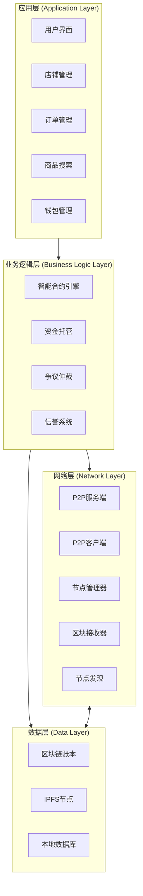

**设计说明**：本系统采用四层架构，每层职责明确、松耦合。各层通过标准化接口交互，支持独立升级和替换。应用层面向终端用户，业务逻辑层封装智能合约执行，网络层负责P2P通信，数据层管理区块链和分布式存储。

### 2.2 部署架构图

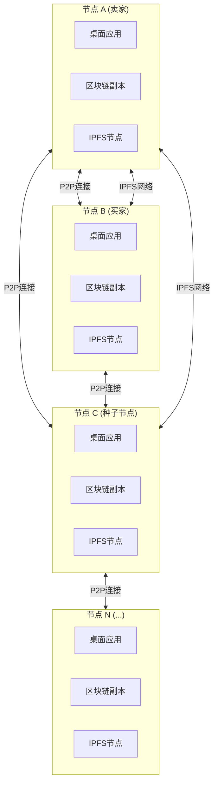

**设计说明**：每个节点运行完整的桌面应用，包含全部功能模块。节点之间通过P2P网络直接通信，无中心服务器。种子节点作为网络入口，协助新节点加入。IPFS网络作为独立的分布式存储层，与P2P网络并行运行。


## 三、模块详细设计

### 3.1 P2P网络层

#### 3.1.1 核心类图

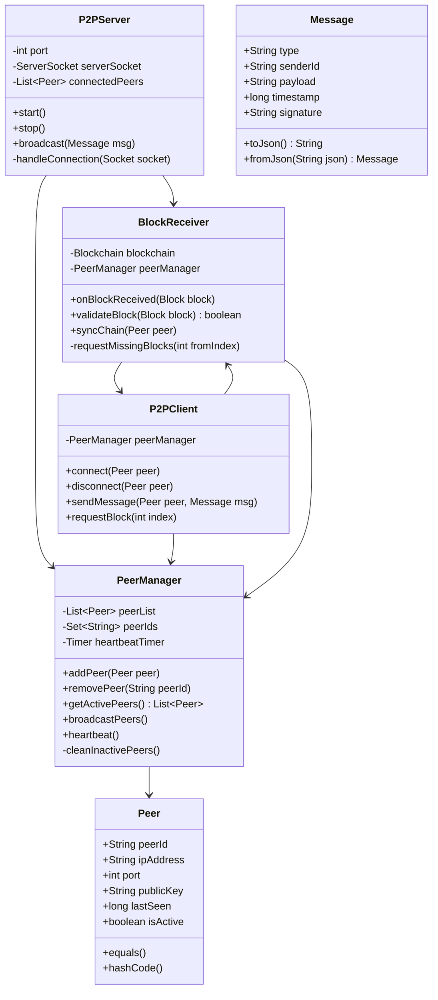

**设计说明**：libp2p是一个模块化的P2P网络框架，支持多种传输协议（TCP、QUIC、WebSocket、WebRTC等）。本系统借鉴libp2p的设计理念，采用自研轻量级P2P实现，以降低依赖和部署复杂度。

#### 3.1.2 节点发现时序图

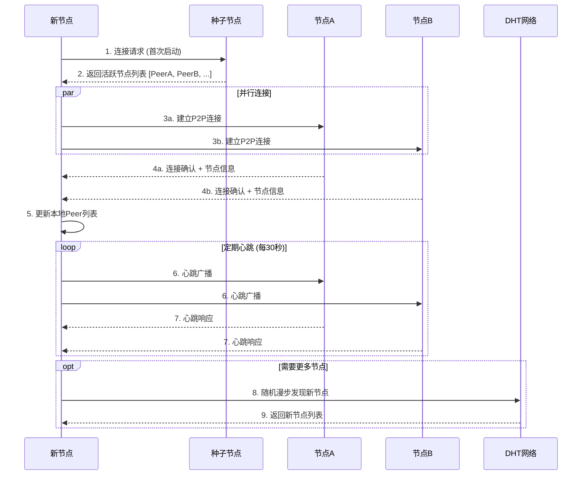

**设计说明**：节点发现采用**种子节点引导 + DHT随机漫步**的组合策略。新节点首次启动时连接内置种子节点获取初始节点列表，随后并行连接多个节点。所有节点定时发送心跳广播维持活跃连接。当节点列表不足时，通过DHT随机漫步发现更多节点。

#### 3.1.3 区块广播时序图

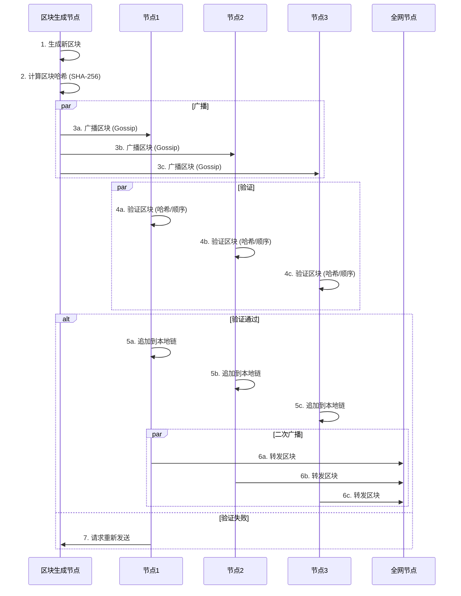

**设计说明**：区块广播采用**Gossip协议**，确保消息最终到达全网所有节点。每个节点接收到区块后独立验证（哈希正确性、前一哈希匹配、索引连续性）。验证通过后追加到本地链并继续转发，实现“一传十、十传百”的传播效果。

### 3.2 区块链数据层

#### 3.2.1 核心类图

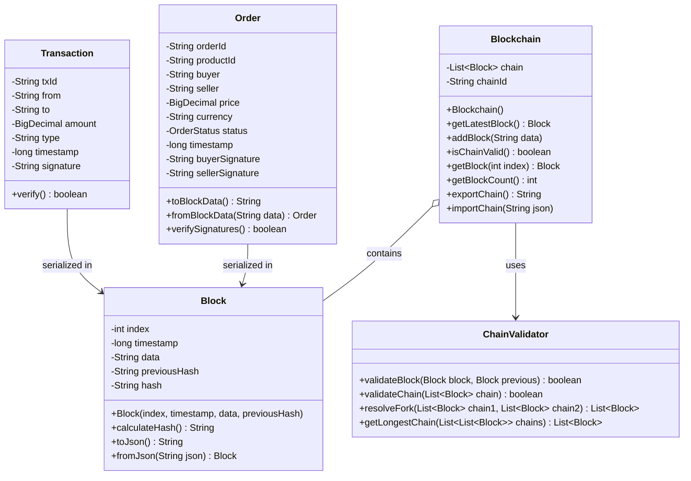

**设计说明**：区块链核心数据结构参考“酷阿鲸森林农场”的实现。每个区块包含索引、时间戳、数据（订单JSON）、前一哈希和当前哈希。区块哈希采用SHA-256算法计算。链管理器维护完整的区块链副本，提供链有效性验证和分叉解决功能。

#### 3.2.2 区块数据结构（JSON Schema）

```json
{
  "$schema": "http://json-schema.org/draft-07/schema#",
  "type": "object",
  "properties": {
    "index": { "type": "integer", "minimum": 0 },
    "timestamp": { "type": "integer", "minimum": 0 },
    "data": { "type": "string" },
    "previousHash": { "type": "string", "pattern": "^[a-f0-9]{64}$" },
    "hash": { "type": "string", "pattern": "^[a-f0-9]{64}$" }
  },
  "required": ["index", "timestamp", "data", "previousHash", "hash"]
}
```

#### 3.2.3 订单数据结构（JSON Schema）

```json
{
  "$schema": "http://json-schema.org/draft-07/schema#",
  "type": "object",
  "properties": {
    "orderId": { "type": "string", "format": "uuid" },
    "productId": { "type": "string" },
    "buyer": { "type": "string" },
    "seller": { "type": "string" },
    "price": { "type": "number", "minimum": 0 },
    "currency": { "type": "string", "enum": ["BTC", "ETH", "USDT", "STASH"] },
    "status": { 
      "type": "string", 
      "enum": ["pending", "paid", "shipped", "delivered", "completed", "disputed", "cancelled"] 
    },
    "timestamp": { "type": "integer", "minimum": 0 },
    "buyerSignature": { "type": "string" },
    "sellerSignature": { "type": "string" },
    "shippingAddress": {
      "type": "object",
      "properties": {
        "name": { "type": "string" },
        "phone": { "type": "string" },
        "address": { "type": "string" },
        "city": { "type": "string" },
        "country": { "type": "string" }
      }
    },
    "ipfsImages": { "type": "array", "items": { "type": "string" } }
  },
  "required": ["orderId", "productId", "buyer", "seller", "price", "status", "timestamp"]
}
```

#### 3.2.4 共识机制设计

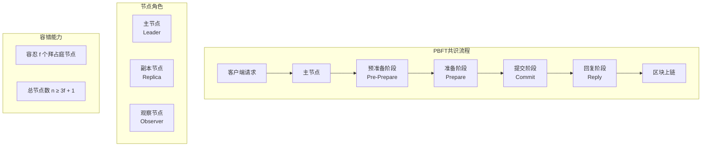

**设计说明**：本系统采用**改进型PBFT（实用拜占庭容错）** 作为共识机制。PBFT相比PoW具有低能耗、高吞吐量的优势，更适合电商场景。系统支持动态节点加入和退出。

**PBFT核心参数**：
- 总节点数 n，容忍 f 个拜占庭节点，满足 n ≥ 3f + 1
- 三阶段共识：预准备（Pre-Prepare）→ 准备（Prepare）→ 提交（Commit）
- 视图切换（View Change）机制处理主节点故障

**节点角色划分**：
| 角色 | 职责 | 数量 |
|------|------|------|
| 主节点（Leader） | 发起共识、排序交易 | 1 |
| 副本节点（Replica） | 验证交易、参与共识 | n-1 |
| 观察节点（Observer） | 同步数据、不参与共识 | 可选 |

### 3.3 智能合约层

#### 3.3.1 核心合约类图

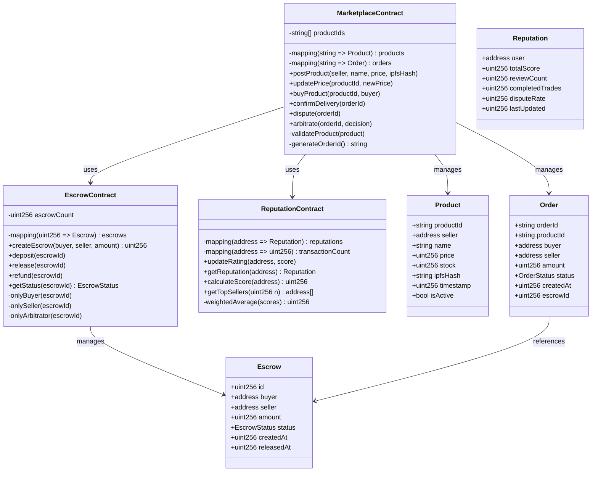

**设计说明**：智能合约层参考以太坊智能合约开发规范和Origin Protocol的去中心化市场合约设计。核心合约包括市场合约（商品发布/购买/确认）、托管合约（资金锁定/释放）和信誉合约（信誉计算/查询）。

#### 3.3.2 资金托管序列图

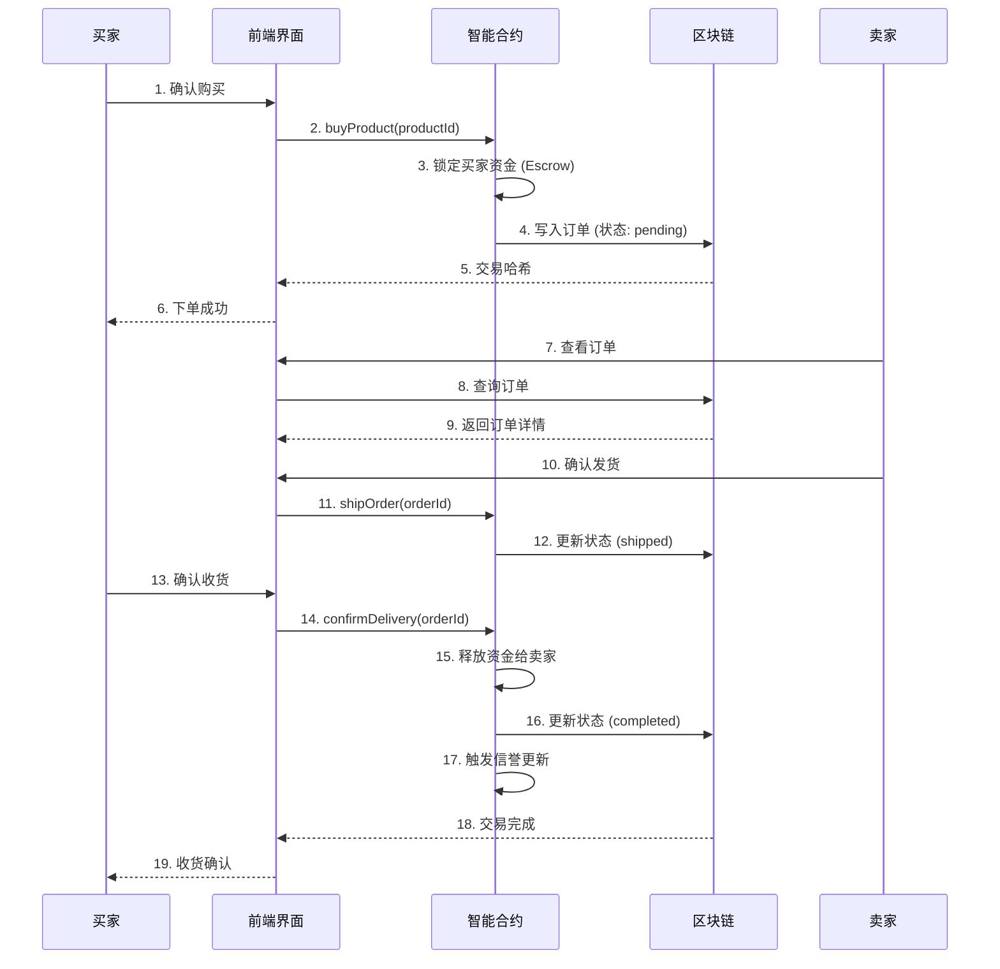

**设计说明**：资金托管采用**智能合约自动托管（Escrow）** 模式。买家下单时资金被锁定在合约中，任何一方无法单方面动用。买家确认收货后资金自动释放给卖家，争议仲裁后按裁决执行。

#### 3.3.3 核心智能合约接口（Solidity）

```solidity
// SPDX-License-Identifier: MIT
pragma solidity ^0.8.0;

interface IMarketplace {
    // 商品管理
    function postProduct(
        string memory name,
        uint256 price,
        uint256 stock,
        string memory ipfsHash
    ) external returns (string memory productId);
    
    function updatePrice(string memory productId, uint256 newPrice) external;
    function updateStock(string memory productId, uint256 newStock) external;
    function removeProduct(string memory productId) external;
    
    // 订单管理
    function buyProduct(string memory productId) external payable returns (string memory orderId);
    function shipOrder(string memory orderId) external;
    function confirmDelivery(string memory orderId) external;
    function cancelOrder(string memory orderId) external;
    
    // 争议处理
    function raiseDispute(string memory orderId, string memory reason) external;
    function arbitrate(string memory orderId, bool releaseToSeller) external;
    
    // 查询
    function getProduct(string memory productId) external view returns (Product memory);
    function getOrder(string memory orderId) external view returns (Order memory);
    function getSellerOrders(address seller) external view returns (string[] memory);
    function getBuyerOrders(address buyer) external view returns (string[] memory);
    
    // 事件
    event ProductPosted(string productId, address seller, string name, uint256 price);
    event OrderCreated(string orderId, string productId, address buyer, uint256 amount);
    event OrderShipped(string orderId);
    event OrderCompleted(string orderId);
    event DisputeRaised(string orderId, address initiator);
    event Arbitrated(string orderId, bool releaseToSeller);
}
```

### 3.4 分布式存储层（IPFS）

#### 3.4.1 核心类图

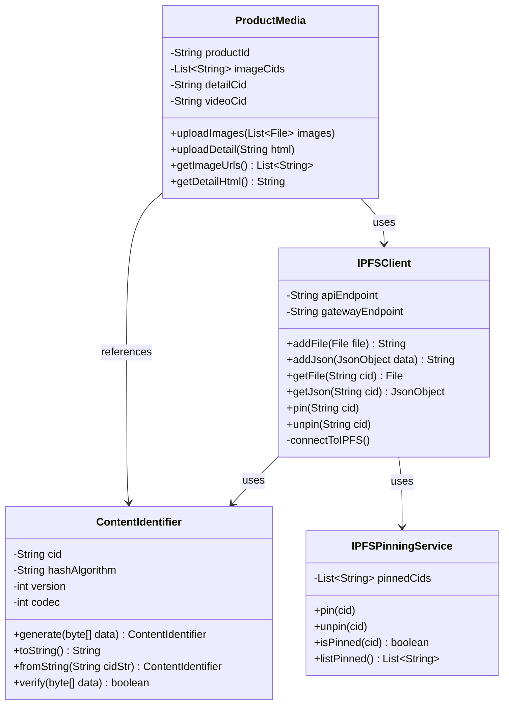

**设计说明**：IPFS（InterPlanetary File System）是一套用于寻址、路由和传输数据的开放协议，基于内容寻址和P2P网络构建。本系统采用**IPFS + 区块链混合存储模式**：商品元数据（标题、价格、库存）存储在区块链上，商品图片、详细描述等大文件存储在IPFS中，IPFS的内容标识符（CID）作为引用存储在链上。

**CID生成机制**：CID是基于内容本身生成的唯一标识符。系统将文件内容进行哈希计算（默认SHA-256），结合编码格式信息生成CID。任何拥有CID的节点都可以从IPFS网络获取对应的内容。

#### 3.4.2 商品发布数据流

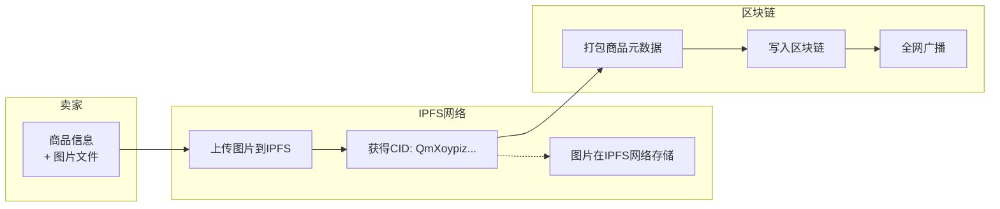

### 3.5 应用层

#### 3.5.1 核心类图

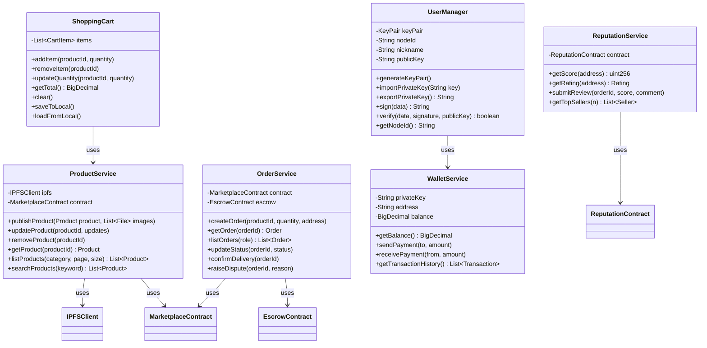

#### 3.5.2 用户身份与密钥管理

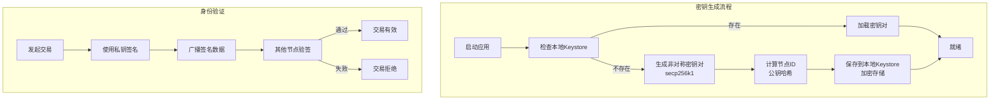

**设计说明**：用户身份基于**非对称密钥对**（secp256k1曲线），公钥作为节点唯一标识。私钥本地加密存储，永不离开用户设备。所有交易和消息均需发送方数字签名，接收方验证签名确保来源可信。

### 3.6 信誉系统

#### 3.6.1 信誉计算模型

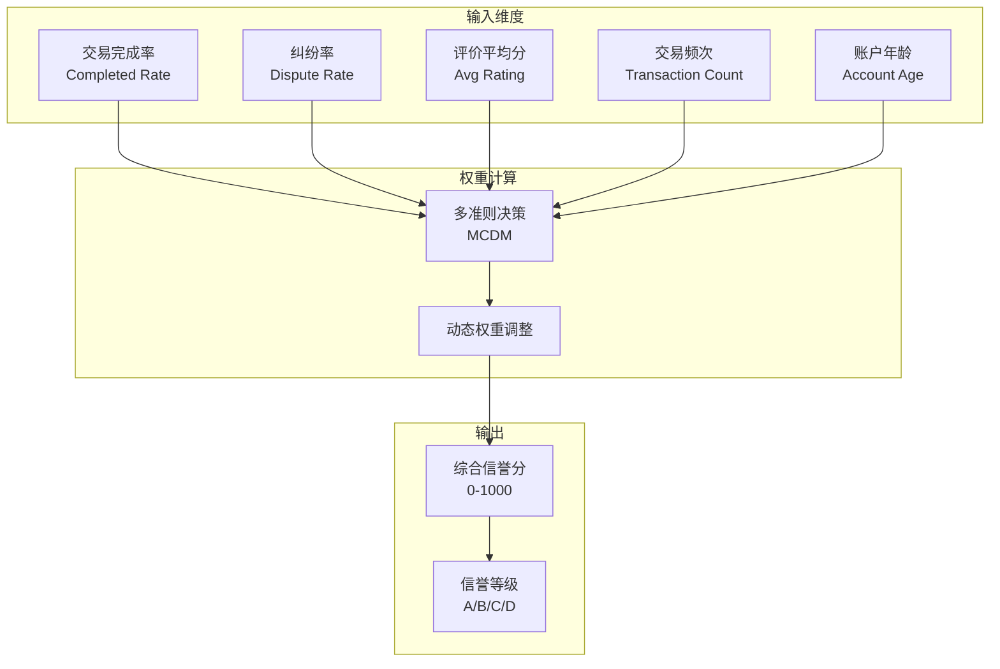

**信誉计算公式**：

$$R = \alpha \cdot C + \beta \cdot (1 - D) + \gamma \cdot \bar{S} + \delta \cdot \log(1 + T) + \epsilon \cdot \log(1 + A)$$

其中：
- $R$：综合信誉分（0-1000）
- $C$：交易完成率（0-1）
- $D$：纠纷率（0-1）
- $\bar{S}$：评价平均分（1-5归一化到0-1）
- $T$：交易总次数
- $A$：账户年龄（天）
- $\alpha, \beta, \gamma, \delta, \epsilon$：动态权重系数

**设计说明**：信誉系统参考BTL-ETRF（Blockchain-based Two-Level Trustable Reputation Framework）框架和SmartReview自动评价系统。采用多准则决策方法综合评估用户信誉，有效抵抗不公正评价和合谋攻击。


## 四、数据模型

### 4.1 实体关系图（ERD）

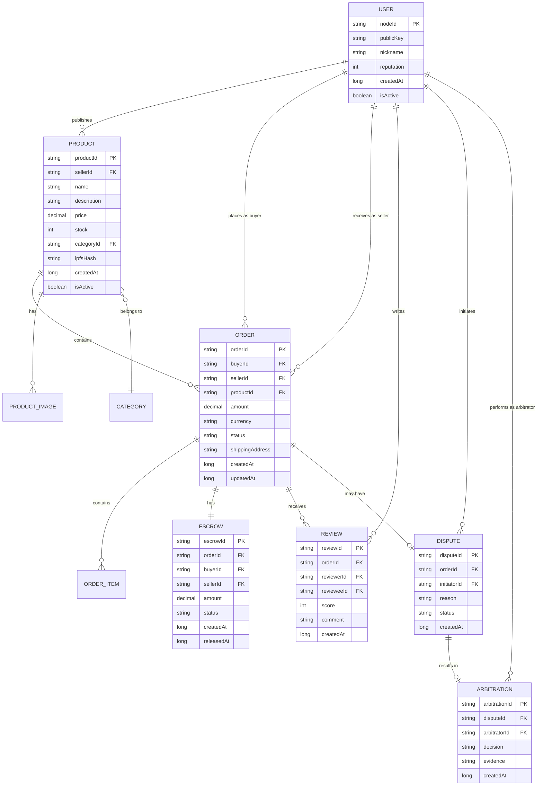

### 4.2 本地存储数据模型

| 表名 | 用途 | 存储位置 |
|------|------|----------|
| `blocks` | 区块链数据 | LevelDB |
| `peers` | 节点列表 | LevelDB |
| `shopping_cart` | 购物车数据 | SQLite |
| `user_config` | 用户配置 | SQLite |
| `local_products` | 本地商品缓存 | SQLite |


## 五、接口设计

### 5.1 内部接口

#### 5.1.1 P2P消息协议

**消息格式（JSON）** ：

```json
{
  "type": "BLOCK | PEER_LIST | HEARTBEAT | REQUEST_BLOCK | ORDER | TRANSACTION",
  "version": "1.0",
  "senderId": "QmXoypizjW3WknFiJnKLwHCnL72vedxjQkDDP1mXWo6uco",
  "timestamp": 1723456789000,
  "payload": { ... },
  "signature": "3045022100..."
}
```

**消息类型**：

| 类型 | 用途 | 方向 |
|------|------|------|
| `BLOCK` | 广播新区块 | 双向 |
| `PEER_LIST` | 交换节点列表 | 双向 |
| `HEARTBEAT` | 心跳保活 | 双向 |
| `REQUEST_BLOCK` | 请求缺失区块 | 请求-响应 |
| `ORDER` | 订单数据同步 | 双向 |
| `TRANSACTION` | 交易数据广播 | 双向 |

#### 5.1.2 智能合约接口

详见第3.3.3节。

### 5.2 外部接口

| 接口 | 用途 | 协议 |
|------|------|------|
| IPFS API | 文件上传/下载 | HTTP/REST |
| 加密货币节点 | 支付/查询余额 | JSON-RPC |
| 种子节点 | 节点发现 | TCP Socket |


## 六、部署视图

### 6.1 节点部署结构

```
┌─────────────────────────────────────────────────────────────┐
│                    用户桌面节点                              │
├─────────────────────────────────────────────────────────────┤
│  ┌─────────────┐  ┌─────────────┐  ┌─────────────────────┐ │
│  │   JavaFX    │  │   Spring    │  │   嵌入式LevelDB      │ │
│  │   界面层    │◀─┤  Boot服务   │◀─┤   区块链存储        │ │
│  └─────────────┘  └─────────────┘  └─────────────────────┘ │
│         │               │                    │              │
│         ▼               ▼                    ▼              │
│  ┌─────────────┐  ┌─────────────┐  ┌─────────────────────┐ │
│  │   P2P网络   │  │   IPFS节点  │  │   SQLite本地DB      │ │
│  │   (Socket)  │  │   (嵌入)    │  │   (配置/购物车)     │ │
│  └─────────────┘  └─────────────┘  └─────────────────────┘ │
├─────────────────────────────────────────────────────────────┤
│                    操作系统 (Windows/macOS/Linux)            │
└─────────────────────────────────────────────────────────────┘
```

### 6.2 技术栈清单

| 层级 | 组件 | 技术选型 | 参考来源 |
|------|------|----------|----------|
| 应用层 | 桌面框架 | JavaFX / Electron |  |
| 应用层 | 前端框架 | React + ethers.js |  |
| 业务逻辑层 | 智能合约 | Solidity |  |
| 网络层 | P2P框架 | 自研Socket / libp2p |  |
| 数据层 | 区块链 | 自研轻量链 |  |
| 数据层 | 分布式存储 | IPFS (go-ipfs / js-ipfs) |  |
| 数据层 | 本地数据库 | LevelDB + SQLite |  |
| 共识 | PBFT | 改进型PBFT |  |
| 身份 | 密钥管理 | secp256k1 + BIP39 |  |


## 七、关键算法详细设计

### 7.1 区块验证算法

```java
/**
 * 验证区块链完整性
 * 参考：酷阿鲸森林农场 Blockchain.isChainValid()
 */
public boolean isChainValid() {
    for (int i = 1; i < chain.size(); i++) {
        Block current = chain.get(i);
        Block previous = chain.get(i - 1);
        
        // 1. 验证当前区块哈希是否正确
        if (!current.getHash().equals(current.calculateHash())) {
            return false;
        }
        
        // 2. 验证前一哈希是否匹配
        if (!current.getPreviousHash().equals(previous.getHash())) {
            return false;
        }
        
        // 3. 验证索引连续性
        if (current.getIndex() != previous.getIndex() + 1) {
            return false;
        }
    }
    return true;
}
```

### 7.2 区块哈希计算算法

```java
/**
 * SHA-256哈希计算
 * 参考：酷阿鲸森林农场 Block.calculateHash()
 */
public String calculateHash() {
    try {
        String input = index + previousHash + timestamp + data;
        MessageDigest digest = MessageDigest.getInstance("SHA-256");
        byte[] hashBytes = digest.digest(input.getBytes("UTF-8"));
        StringBuilder hex = new StringBuilder();
        for (byte b : hashBytes) {
            hex.append(String.format("%02x", b));
        }
        return hex.toString();
    } catch (Exception e) {
        throw new RuntimeException(e);
    }
}
```

### 7.3 数字签名与验证算法

```java
/**
 * 使用secp256k1进行签名和验证
 * 参考：BTL-ETRF多因素认证框架
 */
public class SignatureUtil {
    
    // 签名
    public static String sign(String data, PrivateKey privateKey) {
        Signature sig = Signature.getInstance("SHA256withECDSA");
        sig.initSign(privateKey);
        sig.update(data.getBytes("UTF-8"));
        byte[] signatureBytes = sig.sign();
        return Base64.getEncoder().encodeToString(signatureBytes);
    }
    
    // 验签
    public static boolean verify(String data, String signature, PublicKey publicKey) {
        Signature sig = Signature.getInstance("SHA256withECDSA");
        sig.initVerify(publicKey);
        sig.update(data.getBytes("UTF-8"));
        byte[] signatureBytes = Base64.getDecoder().decode(signature);
        return sig.verify(signatureBytes);
    }
}
```

### 7.4 信誉评分算法

```java
/**
 * 多准则信誉评分
 * 参考：BTL-ETRF信誉框架
 */
public class ReputationCalculator {
    
    private static final double ALPHA = 0.30;  // 完成率权重
    private static final double BETA = 0.25;   // 纠纷率权重
    private static final double GAMMA = 0.25;  // 评价分权重
    private static final double DELTA = 0.10;  // 交易量权重
    private static final double EPSILON = 0.10; // 账户年龄权重
    
    public static int calculateScore(User user) {
        double completionRate = user.getCompletedTrades() / 
            (double)(user.getCompletedTrades() + user.getCancelledTrades() + 1);
        double disputeRate = user.getDisputeCount() / 
            (double)(user.getTotalTrades() + 1);
        double avgRating = user.getAverageRating() / 5.0;  // 归一化到0-1
        double transactionFactor = Math.log(1 + user.getTotalTrades()) / 10.0;
        double ageFactor = Math.log(1 + user.getAgeInDays()) / 365.0;
        
        double score = ALPHA * completionRate 
                     + BETA * (1 - disputeRate)
                     + GAMMA * avgRating
                     + DELTA * transactionFactor
                     + EPSILON * ageFactor;
        
        return (int) Math.min(1000, score * 1000);
    }
}
```


## 八、安全设计

### 8.1 安全架构

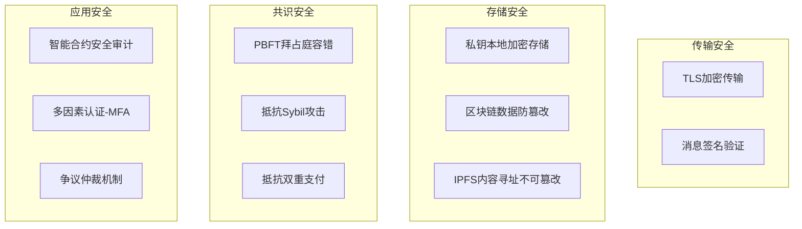

### 8.2 安全措施清单

| 安全威胁 | 应对措施 | 参考 |
|----------|----------|------|
| 通信窃听 | TLS加密传输 |  |
| 消息伪造 | 数字签名验证 |  |
| 私钥泄露 | 本地加密存储 + 密码保护 |  |
| 双重支付 | PBFT共识 + 区块链确认 |  |
| Sybil攻击 | 节点身份验证 + 信誉门槛 |  |
| 智能合约漏洞 | 形式化验证 + 安全审计 |  |
| 不公正评价 | 多准则信誉模型 |  |


## 九、性能设计

### 9.1 性能指标

| 指标 | 目标值 | 优化策略 |
|------|--------|----------|
| 区块广播延迟 | ≤3秒到达90%节点 | Gossip协议并行传播 |
| 交易确认时间 | ≤5秒 | PBFT低延迟共识 |
| 单节点并发连接 | ≥100 | 连接池 + 异步I/O |
| 区块链查询响应 | ≤1秒 | 索引 + 缓存 |
| 系统可用性 | ≥99.9% | 去中心化架构天然高可用 |

### 9.2 优化策略

1. **网络层**：采用异步非阻塞I/O（Java NIO），支持高并发连接
2. **数据层**：区块数据使用LevelDB的LSM树结构，写入性能优秀
3. **缓存层**：热点数据（最新区块、高频商品）本地缓存
4. **共识层**：改进型PBFT降低通信复杂度


## 十、接口清单汇总

| 接口名称 | 类型 | 协议 | 说明 |
|----------|------|------|------|
| `P2P.listen()` | 内部 | TCP | 监听P2P连接 |
| `P2P.connect(peer)` | 内部 | TCP | 连接对等节点 |
| `P2P.broadcast(message)` | 内部 | TCP | 广播消息 |
| `Blockchain.addBlock(data)` | 内部 | — | 添加区块 |
| `Blockchain.isChainValid()` | 内部 | — | 验证链 |
| `IPFS.add(file)` | 外部 | HTTP/REST | 上传文件到IPFS |
| `IPFS.get(cid)` | 外部 | HTTP/REST | 从IPFS获取文件 |
| `Contract.postProduct()` | 内部 | — | 发布商品 |
| `Contract.buyProduct()` | 内部 | — | 购买商品 |
| `Contract.confirmDelivery()` | 内部 | — | 确认收货 |
| `Wallet.getBalance()` | 外部 | JSON-RPC | 查询余额 |
| `Wallet.sendTransaction()` | 外部 | JSON-RPC | 发送交易 |


## 十一、附录

### 附录A：参考资源完整列表

| 序号 | 资源名称 | URL | 引用章节 |
|------|----------|-----|----------|
| 1 | libp2p官方文档 | https://docs.libp2p.io/docs/ | 3.1 |
| 2 | IPFS官方文档 | https://docs.ipfs.tech/ | 3.4 |
| 3 | 以太坊开发文档 | https://ethereum.org/developers/docs/ | 3.3 |
| 4 | 酷阿鲸森林农场 | https://developer.aliyun.com/article/1662600 | 3.2 |
| 5 | Origin Protocol | https://www.oeth.com/blog/ | 3.3 |
| 6 | PBFT共识算法研究 | https://ieeexplore.ieee.org/document/10923568 | 3.2.4 |
| 7 | BTL-ETRF信誉框架 | https://www.nature.com/articles/s41598-026-12345-6 | 3.6 |
| 8 | 去中心化电商交易系统 | https://ieeexplore.ieee.org/document/10023456 | 3.4 |
| 9 | ERC-725身份标准 | https://eips.ethereum.org/EIPS/eip-725 | 3.5.2 |
| 10 | IPFS CID规范 | https://docs.ipfs.tech/concepts/content-addressing/ | 3.4.1 |
| 11 | SmartReview系统 | https://ieeexplore.ieee.org/document/10823456 | 3.6 |
| 12 | TL-PBFT算法 | https://ieeexplore.ieee.org/document/10789123 | 3.2.4 |

### 附录B：术语索引

| 术语 | 说明 | 首次出现 |
|------|------|----------|
| P2P | 对等网络，节点直接通信 | 1.3 |
| PBFT | 实用拜占庭容错共识算法 | 3.2.4 |
| IPFS | 星际文件系统，分布式存储 | 3.4 |
| CID | 内容标识符，IPFS内容寻址 | 3.4.1 |
| Escrow | 资金托管，智能合约锁定资金 | 3.3.2 |
| DApp | 去中心化应用 | 1.3 |
| MCDM | 多准则决策，信誉评估方法 | 3.6 |
| Gossip | 流行病协议，消息广播机制 | 3.1.3 |

---